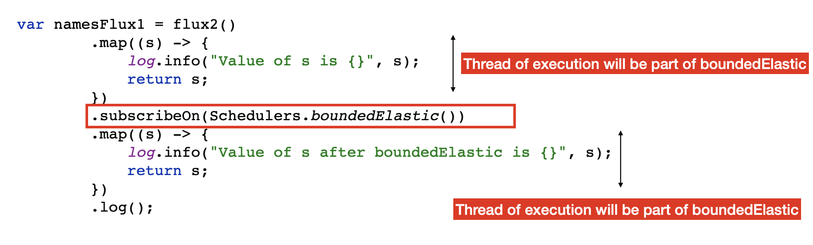

# Spring
# Spring Initializer

https://start.spring.io/

Atraves do initializer, podemos montar o projeto com as dependencias:

* **DevTools** -> faz com que as changes sejam atualizadas automáticas;
  *  **LiveReload** -> faz com que a pagina mesmo se atualize sozinha;
* **Web**
* **Security**
* **Lombok**
* **Spring JPA** -> Dependencias do JPA, para conexão e gestão do banco de dados;

# Set-ups

## Changing Port

application.properties:

```properties
# Changing the server port
server.port=9000
```

## Working with JSP

Para utilizar a JSP é necessário adicionar as dependencias abaixo:

```xml
<dependency>
	<groupId>org.apache.tomcat.embed</groupId>
	<artifactId>tomcat-embed-jasper</artifactId>
	<scope>provided</scope>
</dependency>

<dependency>
	<groupId>javax.servlet</groupId>
	<artifactId>jstl</artifactId>
</dependency>
```

Adicionar ao arquivo `application.properties`

```properties
spring.mvc.view.prefix=/WEB-INF/views/
spring.mvc.view.suffix=.jsp
```


## Tomcat vs Jetty

Para utilizar Jetty (para servidores reativos):

```xml
<dependency>
	<groupId>org.springframework.boot</groupId>
	<artifactId>spring-boot-starter-web</artifactId>
	<exclusions>
		<exclusion>
			<groupId>org.springframework.boot</groupId>
			<artifactId>spring-boot-starter-tomcat</artifactId>
		</exclusion>
	</exclusions>
</dependency>

<!-- Jetty Dependency -->
<dependency>
  <groupId>org.springframework.boot</groupId>
  <artifactId>spring-boot-starter-jetty</artifactId>
</dependency>
```

## @ComponentScan - Packages diferentes níveis

Quando os packages não ficam no mesmo nível do SpringApplication.java é necessário declarar alguns componentes:

* `@ComponentScan`: is used to map the Controller/Service
* `@EntityScan`: to map the Entity
* `@EnableJpaRepositories`: to map the Repository

```java
@SpringBootApplication
@ComponentScan({"com.vipguestlist.controller", "com.vipguestlist.service"})
@EntityScan({"com.vipguestlist.model"})
@EnableJpaRepositories({"com.vipguestlist.repository"})
public class Configuration {

	public static void main(String[] args) {
		SpringApplication.run(Configuration.class, args);
	}
}
```


## Configurando Databases

É possível via application.properties ou via código:

```java
@SpringBootApplication
public class Configuration {

	public static void main(String[] args) {
		SpringApplication.run(Configuration.class, args);
	}
	
	/** JPA ConfigurationS
	 *  @bean it's necessary for Spring to "manage" the class
	 *  DriverManagerDataSource returns DataSource
	 */
	@Bean
	public DataSource dataSource() {
		DriverManagerDataSource driver = new DriverManagerDataSource();
		driver.setDriverClassName("com.mysql.cj.jdbc.Driver");
		driver.setUrl("jdbc:mysql://localhost/viplist?createDatabaseIfNotExist=true&useSSL=false&serverTimezone=UTC");
		driver.setUsername("root");
		driver.setPassword("");
		return driver;
	}
}
```


### DB2

pom.xml

```xml
<dependency>
	<groupId>org.springframework.boot</groupId>
	<artifactId>spring-boot-starter-data-jpa</artifactId>
</dependency>
<dependency>
  <groupId>com.ibm.db2</groupId>
  <artifactId>jcc</artifactId>
  <version>11.5.0.0</version>
</dependency>
```

application.properties:

```properties
# DATABASE CONNECTION
spring.datasource.url=jdbc:db2://host.databases.appdomain.cloud:32224/BLUDB:sslConnection=true;sslTrustStoreLocation=/tmp/cpc-cert.jk
spring.datasource.username=your-user
spring.datasource.password=your-pass

# SPRING CONFIGS TO NOT SHOW ERRORS
spring.jpa.open-in-view = false
logging.level.org.hibernate=ERROR
```


### MySQL

Para rodar com container:

```bash
podman run --name mysql-spring-security -e MYSQL_DATABASE=YOURDATA -e MYSQL_USER=igor -e MYSQL_PASSWORD=igor@123 -e MYSQL_ROOT_PASSWORD=igor@123 -d -p 3306:3306 mysql
```

pom.xml:

```xml
<dependency>
	<groupId>org.springframework.boot</groupId>
	<artifactId>spring-boot-starter-data-jpa</artifactId>
</dependency>
<dependency>
	<groupId>mysql</groupId>
	<artifactId>mysql-connector-java</artifactId>
</dependency>
```

application.properties:

```properties
#Spring with JSP (optional)
spring.mvc.view.prefix= /WEB-INF/views/
spring.mvc.view.suffix= .jsp

#DataSource
spring.datasource.driver-class-name=com.mysql.cj.jdbc.Driver
spring.datasource.url=jdbc:mysql://localhost/XXXXXXX?createDatabaseIfNotExist=true&useSSL=false&serverTimezone=UTC
spring.datasource.username=root
spring.datasource.password=

#JPA
spring.jpa.hibernate.ddl-auto = update
spring.jpa.properties.hibernate.format_sql = true
spring.jpa.properties.hibernate.show_sql = true
```

### H2

Application.properties

```properties
#DataSource
spring.datasource.driver-class-name=org.h2.Driver
spring.datasource.url=jdbc:h2:mem:forum
spring.datasource.username=sa
spring.datasource.password=

#JPA
spring.jpa.database-platform=org.hibernate.dialect.H2Dialect
spring.jpa.hibernate.ddl-auto = update
spring.jpa.properties.hibernate.format_sql = true
spring.jpa.properties.hibernate.show_sql = true

#H2
# console.enabled allow us to have a h2 console
# console.path is how we're going to access the h2 interface
spring.h2.console.enabled=true
spring.h2.console.path=/h2-console
```

* Open the console by: `http://localhost:8080/h2-console`


#### Carregar dados

Com o H2 em memória, é possível criar um arquivo `import.sql` dentro da folder `src/resources` para que H2 faça os inserts automaticamente!


### PostgreSQL

```bash
docker run --name postgres -e POSTGRES_PASSWORD=123 -e POSTGRES_USER=user -p 5432:5432 -d postgres:15.3-alpine3.18
```

`application.yml` com config do Postgres

```yaml
spring:
    datasource:
        url: jdbc:postgresql://localhost:5432/energy-monitor
        driverClassName: org.postgresql.Driver
        username: ${DBUSER:user}
        password: ${DBPASS:123}
```

Importante ter no pom:

```xml
<dependency>
    <groupId>org.postgresql</groupId>
    <artifactId>postgresql</artifactId>
    <version>42.6.0</version>
</dependency>
```


### Múltiplos Databases

E se precisarmos nos conectar em diferentes databases? servidores?

* Com Spring, precisamos mapear utilizando o **`JDBC Template`**


Se conecte em 2 diferentes servidores:

```yaml
# application.yml
spring:
  jpa.open-in-view: false
	datasource:
    server1:
      jdbc-url: ${DB2_BASEURL_SERVER1}
      username: ${DB2_USERNAME_SERVER1}
      password: ${DB2_PASSWORD_SERVER1}
    server2:
      jdbc-url: ${DB2_BASEURL_SERVER2}
      username: ${DB2_USERNAME_SERVER2}
      password: ${DB2_PASSWORD_SERVER2}
```


Criar os Beans para o Spring:

```java
// src/main/configuration
@Configuration
public class DataSourceConfig {

  @Bean(name = "server1")
  @ConfigurationProperties(prefix = "spring.datasource.server1")
  public DataSource dataSource1() {
    return DataSourceBuilder.create().build();
  }

  @Bean(name = "jdbcTemplateServer1")
  public JdbcTemplate jdbcTemplate1(@Qualifier("server1") DataSource ds) {
    return new JdbcTemplate(ds);
  }

  @Bean(name = "server2")
  @ConfigurationProperties(prefix = "spring.datasource.server2")
  public DataSource dataSource2() {
    return DataSourceBuilder.create().build();
  }

  @Bean(name = "jdbcTemplateServer2")
  public JdbcTemplate jdbcTemplate2(@Qualifier("server2") DataSource ds) {
    return new JdbcTemplate(ds);
  }
}
```


Para executar SQLs:

```java
// src/main/configuration
@Slf4j
@Component
public class JdbcTemplateUtils {

  private static final String SELECT_COUNT = "SELECT COUNT(*) FROM ";
  private static final String GET_ALL_TABLES = "SELECT NAME FROM SYSIBM.SYSTABLES WHERE CREATOR = '";

  public static List<String> queryForListOfStrings(JdbcTemplate jdbcTemplate, String sql) {
    try {
      return jdbcTemplate.query(sql, new RowMapper<String>() {
        @Override
        public String mapRow(ResultSet resultSet, int rowNum) throws SQLException {
          return resultSet.getString("NAME");
        }
      });
    } catch (Exception e) {
      throw new RuntimeException(e.getMessage());
    }
  }

  public List<String> getAllTablesFrom(JdbcTemplate server1, String schemaName) {
    String sql = GET_ALL_TABLES + schemaName + "' ORDER BY CARD DESC";
    return executeTablesQuery(server1, sql);
  }

  private String getCountSql(String schemaName, String tableName) {
    return SELECT_COUNT + schemaName + "." + tableName;
  }

  private Integer executeIntegerQuery(JdbcTemplate jdbcTemplate, String sql) {
    try {
      return jdbcTemplate.queryForObject(sql, Integer.class);
    } catch (Exception e) {
      log.error("QREP MONITOR - ERROR: {}", e.getMessage());
      throw new RuntimeException(e.getMessage());
    }
  }

  private List<String> executeTablesQuery(JdbcTemplate jdbcTemplate, String sql) {
    try {
      return JdbcTemplateUtils.queryForListOfStrings(jdbcTemplate, sql);
    } catch (Exception e) {
      log.error("QREP MONITOR - ERROR: {}", e.getMessage());
      throw new RuntimeException(e.getMessage());
    }
  }
}

```


# Annotations

## @ResponseBody

`@ResponseBody` é utilizado para informar o Spring que ele irá farzer o parse de um objeto para um JSON

```java
@Controller
public class TopicController {

	@RequestMapping("/firstEndPoint")
	@ResponseBody
	public List<Topic> list(){
		Topic topic = new Topic("Doubt", "API Doubt", new Course("Java", "API"));
		
		return Arrays.asList(topic, topic, topic);
	}
}
```


### @RestController

Se é esperado que o response seja um JSON e não quer q todo método tenha o `@ResponseBody`, então anotamos a controller com o `@RestController`

```java
@RestController
public class TopicController {

	@RequestMapping("/firstEndPoint")
	// @ResponseBody
	public List<Topic> list(){
		Topic topic = new Topic("Doubt", "API Doubt", new Course("Java", "API"));
		
		return Arrays.asList(topic, topic, topic);
	}
}
```

## @RequestBody

Se o `@ResponseBody` é para dizer ao Spring que queremos que seja parcionado o Objeto -> JSON no Response, o `RequestBody` fará o mesmo para o Request recebido

```java
@PostMapping
@Transactional
public ResponseEntity<TopicDTO> save(@RequestBody TopicForm form, UriComponentsBuilder uriBuilder) {
	Topic topic = form.toTopic(courseRepository);
	topicRepository.save(topic);
	
	URI uri = uriBuilder.path("/topic/{id}").buildAndExpand(topic.getId()).toUri();
	
	return ResponseEntity.created(uri).body(new TopicDTO(topic));
}
```


## @Valid / BeanValidation

* DOC OFICIAL: https://jakarta.ee/specifications/bean-validation/3.0/jakarta-bean-validation-spec-3.0.html#builtinconstraints

`@Valid` é utilizado para fazer a validação dos campos que estão vindo no request! Mas para isso é necessário o uso de algumas outra annotations:

* `@NotNull @NotEmpty @Length(min = 5) @Size @Enumerated`

```java
public class TopicForm {

	@NotNull @NotEmpty
  @NotBlank(message = "Sender ID is mandatory")
	@Size(min = 2, max = 20, message = "Sender ID minimum size is 2 and maximum is 20")
	private String title, senderId;
	
	@NotNull(message = "Blocked is mandatory - True or False")
	private Boolean blocked;
  
  @Email
  private String email;
  
  @Enumerated(EnumType.STRING)
	private VendorProfileTypeEnum vendorType;
  
  @JsonFormat(shape = JsonFormat.Shape.STRING, pattern = "yyyy-MM-dd HH:mm:ss")
	private LocalDateTime fixDate;
  
  @ApiModelProperty(value = "Specific days notification will not trigger", example = "2020-01-01", required = true)
	@NotNull(message = "Day is mandatory")
	private LocalDate day;
}
```


### @RestControllerAdvice / @ExceptionHandler

Utilizado para fazer o **handle das exceptions**, dessa forma falamos para o Spring como queremos controlar cada tipo de Exception

```java
@RestControllerAdvice
public class ValidationErrorHandler {
	
	@Autowired
	private MessageSource messageSource;

	@ResponseStatus(code = HttpStatus.BAD_REQUEST)
	@ExceptionHandler(MethodArgumentNotValidException.class)
	public List<ErrorDTO> handle(MethodArgumentNotValidException exception) {
		List<ErrorDTO> dto = new ArrayList<>();
		List<FieldError> fieldErrors = exception.getBindingResult().getFieldErrors();
		fieldErrors.forEach(e -> {
			ErrorDTO error = new ErrorDTO(e.getField(), messageSource.getMessage(e, LocaleContextHolder.getLocale()));
			dto.add(error);
		});
		return dto;
	}
}

// DTO
public class ErrorDTO {

	private String field;
	private String exception;

	public ErrorDTO(String field, String exception) {
		this.field = field;
		this.exception = exception;
	}
	//Getters and Setters
}
```

## @JsonProperty

Utilizado para fazer o *bind* das propriedades da classe

* **SEM O @JsonProperty PRECISAMOS TER OS GETTERS**

Errado:

```java
// Jackson não vai conseguir fazer o bind por não ter os GETTERS nem o @JsonProperty
public class User {
  private String name;
  private int age;
}
```

Correto:

```java
public class User {
  @JsonProperty
  private String name;
	@JsonProperty
  private int age;
}
```

ou

```java
@Getter
public class User {
  private String name;
  private int age;
}
```


## @PathVariable

Utilizado quando queremos pegar um argumento do `path`:

Exemplo, path com valor `1`:

```http
http://localhost:3000/1
```

```java
@DeleteMapping("/{id}")
@Transactional
public void getId(@PathVariable Long id) {}
```

## @RequestParam

`@RequestParam` deve ser declarada antes do parâmetro do método e determina que a API deve receber esse parâmetro como tipo URL Query Strings ao ser chamada

```http
http://localhost:3000/user/name=Igor&age=27
```

```java
@RequestController
@RestMapping("user")          
public class ContaCorrenteController { 

	@GetMapping
  public String getUser( 
   @RequestParam(name = "name") String name,  
   @RequestParam(name = "age") String age
	){ 
   return String.format("Name %s, Age %s", name, age); 
 	} 
} 
```


## @Transactional

Toda vez que **vamos salvar algo no DB**, estamos **abrindo uma conexão**, quando o `open-view` está habilitado, o JPA **mantêm a** **conexão com o DB aberta**!

Quando setamos no `application.properties/yaml` o atributo como `false`, estamos falando para o JPA fechar a conexão para cada requisição

```yaml
spring.jpa.open-in-view: false
```

**Problema:**

* **Se a entidade tiver relacionamento com outra entidade** e formos salvar algo **irá dar erro**, pois a JPA irá encerrar a conexão assim que salvar na primeira tabela, e não consiguirá salvar na segunda tabela (irá dar erro 500).

Adicionando o `@Transactional` falamos para o **Spring criar uma transação!**, ou seja, quando vamos salvar algo, o Spring cria uma transação, que só é comitada quando todo processo for finalizado.

* Caso aconteça um problema dentro desta transação, **será feito um ROLLBACK** de tudo que foi feito

```java
@Transactional
public ProdutoDTO save(ProdutoDTO produto) {
    Produto entity = new Produto();
    mapperDtoToEntity(produto, entity);
    var produtoSaved = repo.save(entity);
    return new ProdutoDTO(produtoSaved, produtoSaved.getCategorias());
}
```


Também é possível declarar o transactional como `readonly = true` para aumentar a performance

```java
@Transactional(readOnly = true)
public Page<ProdutoDTO> findAll(PageRequest pagina) {
    var produtos = repo.findAll(pagina);

    return produtos.map(prod ->  new ProdutoDTO(prod, prod.getCategorias()));
}
```


# DTO vs Record

A partir do java 16, foi criado um novo recurso, o **`record`** , para:

* Classe imutável
* Apenas atributos
* Construtor
* Somente leitura

ou seja, perfeito para DTOs!

DTO + Lombok:

```java
@Data
@NoArgsConstructor
@AllArgsConstructor
public MyDto() {
  
  @NotNull
  private String name;

  @NotNull
  @Email
  private String email;
}
```

Com Record:

```java
public record MyDto(
  @NotNull
  String name,
  @NotNull
  String email){
}
```


## Record to Entity

Record por ser muito usado como DTO é preciso fazer a conversão para entidade pai

Exemplo:

* DTO:

  ```java
  public record DoctorDto(Long id, String nome, String email, String crm) {}
  ```

* Entity:

  ```java
  @Table(name = "doctors")
  @Entity(name = "Doctor")
  @Getter
  @NoArgsConstructor
  @AllArgsConstructor
  public class Doctor {
  
    @Id
    @GeneratedValue(strategy = GenerationType.IDENTITY)
    private Long id;
    private String nome;
    private String email;
    private String telefone;
    private String crm;
  }
  ```

Para converter de Entity para DTO, basta instanciarmos um controller no DTO:

```java
public record DoctorDto(Long id, String nome, String email, String crm) {

  public DoctorDto(Doctor doctor) {
    this(doctor.getId(), doctor.getNome(), doctor.getEmail(), doctor.getCrm());
  }

}
```

Controller

```java
@GetMapping("/findAll")
public List<DoctorDto> getAllDoctors() {
  return repository.findAll().stream().map(DoctorDto::new).toList();
}
```


## Record & Controller

Podemos manipular o que recebemos no record também!

```java
public record MyRequest(@JsonProperty("PART_NUMBER") String partNumber) {

  public MyRequest(String partNumber) {
    this.partNumber = addZeroInPartNumber(partNumber);
  }

  // Add zero in the Part Number if the length < 12
  private String addZeroInPartNumber(String partNumber) {
    return ("000000000000" + partNumber).substring(partNumber.length());
  }
}
```

Quando chamarmos, teremos um retorno do record alterado:

```java
String partNumber = "123";
MyRequest myRequest = new MyRequest(partNumber);
// myRequest.partNumber = "000000000123"
```


# Pageable

Por default o `findAll` pode receber um `PageRequest`, e um `PageRequest` recebe 2 parâmetros:

* `page` -> initial page
* `size`-> quantidade de páginas

```java
@GetMapping
  public ResponseEntity<Page<ProdutoDTO>> findAll(
      @RequestParam(value = "pagina", defaultValue = "0") Integer pagina,
      @RequestParam(value = "tamanho", defaultValue = "10") Integer tamanho) {

    PageRequest pageRequest = PageRequest.of(pagina, tamanho);
    Page<ProdutoDTO> produtos = produtoService.findAll(pageRequest);
    return ResponseEntity.ok(produtos);
  }
```


Por default, um `findAll(pageRequest)` devolve um tipo `Page`, que irá conter diversas inforções...


# JPA - FOREIGN KEYS

Por padrão a JPA entende que se **uma entidade referencia outra entidades**, deve existir **um relacionamento entre elas!** podendo ser:

* `@ManyToMany`
* `@ManyToOne` / `@OneToMany`
* `@OneToOne`


## Many To One

Considerando que teremos o tipo **ManyToOne**:

* **N Produtos** podem ter **1 Categoria** (Many To One)
* **1 Categoria** pode ter **N Produtos** (One To Many)

Precisaremos declarar em uma delas o relacionamento, seja **ManyToOne**, ou **OneToMany**.

Se formos fazer baseado na table de `Produtos`:

```java
@Entity
@Table(name = "PRODUTOS")
public class Produto {
  
  @Id
  @GeneratedValue(strategy = GenrationType.IDENTITY)
  private Long id;
  
  @ManyToOne
  private Categoria categoria;
}
```

* Com **H2** a JPA irá criar uma **foreign key** na table `Produtos`, algo como:

  ```sql
  alter table produtos
  add constraint fk_produto_categoria
  foreign key (categoria_id) references categorias (id);
  ```

### OneToMany (Relacionamento Bidirecional)

Na tabela de `Categoria` teríamos

```java
@Entity
@Table(name = "CATEGORIAS")
public class Categoria {
  
  @Id
  @GeneratedValue(strategy = GenrationType.IDENTITY)
  private Long id;
  
  @OneToMany
  private List<Produtos> produtos = new ArrayList<>();
}
```

**PORÉM,** se não informarmos a JPA que se trata de um **relacionamento bidirecional**, será criado **outra tabela de joins**, por isso usamos o atributo **`mappedBy`** do `@OneToMany`

* `mappedBy` recebe o nome da tabela que possui o relacionamento
  * No exemplo abaixo, `mappedBy = "categoria"` porque na entidade `Produto` foi mapeado o `@ManyToOne` de com o nome `categoria`

* `cascade` informa ao JPA que se algo acontecer naquela entidade, irá propagar para as demais
  * Nesse exemplo, se uma categoria for deletada, será deletado os produtos que pertencem aquela categoria!


```java
// Produto.java
@Entity
@Table(name = "PRODUTOS")
public class Produto {
  
  @Id
  @GeneratedValue(strategy = GenrationType.IDENTITY)
  private Long id;
  
  @ManyToOne
  private Categoria categoria;
}

// Categoria.java
@Entity
@Table(name = "CATEGORIAS")
public class Categoria {
  
  @Id
  @GeneratedValue(strategy = GenrationType.IDENTITY)
  private Long id;
  
  @OneToMany(mappedBy = "categoria", cascade = CascadeType.ALL)
  private List<Produtos> produtos = new ArrayList<>();
}
```

### Set vs List 

Temos que ter um cuidado ao utilizar `Set` na entidade, e retornar um `List` ao usar o `findAll` da `Repository`!

Para que o `Set` funcione, é necessário ter implementado um `Equals` e `HasCode`, ou usar o `@EqualsAndHashCode(callSuper = true)` do Lombok:

```java
// User.java
@Data
@NoArgsConstructor
@AllArgsConstructor
@Table(name = "USERS")
@Entity
public class User {
  
  @OneToMany(mappedBy = "user", cascade = CascadeType.ALL)
	private Set<Resident> residents = new HashSet<>();

}


// Resident.java
@Data
@Entity
@NoArgsConstructor
@AllArgsConstructor
@Table(name = "RESIDENT")
public class Resident {
  
	@ManyToOne
  @JoinColumn(name = "user_id", nullable = false)
  private User user;
  
  @Override
  public boolean equals(Object o) {
      if (this == o) return true;
      if (!(o instanceof Resident resident)) return false;

      return getId().equals(resident.getId());
  }

  @Override
  public int hashCode() {
      return getId().hashCode();
  }
}
```


### Boa Prática

Sempre se intancia uma List / Collection!

```java
@OneToMany(mappedBy = "produto")
private List<Produtos> produtos = new ArrayList<>();
```


## Many To Many

Considerando que teremos o tipo **ManyToMany**:

* **1 Pedido** pode ter **N Produtos**
* **1 Produto** pode ter **N Pedidos**


Por padrão a JPA iria criar a **TABELA DE JOIN** (`itens_pedido`)


Precisaremos declarar na entidade:

* `@ManyToMany` para uma das `Collections` (`Set<>` , `List<>`)
  * Mas caso queiremos fazer algo customizável, precisamos usar o `@JoinTable`

* `@JoinTable` para informar qual vai ser a table que conterá os IDs de Produto e Categoria
  * Parâmetros:
    * `name` - nome da tabela que será referenciada
    * `joinColumns` - qual a coluna da tabela `Produto` que irá conter o ID
    * `inverseJoinColumns` - qual a coluna da tabela `Categoria` que irá conter o ID

```java
// src/main/entities/Produto

@Entity
@Table(name="tb_produto")
public class Produto {
    @Id
    @GeneratedValue(strategy = GenerationType.UUID)
    private UUID id

    @ManyToMany
    @JoinTable(
            name = "tb_produto_categoria",
            joinColumns = @JoinColumn(name = "produto_id"),
            inverseJoinColumns = @JoinColumn(name = "categoria_id")
    )
    Set<Categoria> categorias = new HashSet<>();
}
```

Agora na entidade `Categoria`, iremos apenas:

* `@ManyToMany` + `mappedBy` -> Como foi referenciado na entidade `Produto` só precisamos referenciar na `Categoria`

```java
// src/main/entities/Categoria
  
@Entity
@Table(name = "tb_categoria")
public class Categoria {

    @Id
    @GeneratedValue(strategy =  GenerationType.IDENTITY)
    private Long id;

    @ManyToMany(mappedBy = "categorias")
    private Set<Produto> produtos = new HashSet<>();
```


**OPCIONAL PARA ALGUNS DATABASES**:

Para funcionar, é preciso criar o script SQL que terá a table auxiliar com as referências:

```sql
CREATE TABLE tb_produto(
		id UUID PRIMARY KEY,
  	name VARCHAR(255) NOT NULL
)

CREATE TABLE tb_categoria(
		id SERIAL PRIMARY KEY,
	  name VARCHAR(255) NOT NULL
)

# Table de referencia
CREATE TABLE tb_produto_categoria(
		produto_id UUID NOT NULL,
  	categoria_id SERIAL NOT NULL,
  	PRIMARY KEY (produto_id, categoria_id),
  	FOREIGN KEY (produto_id) REFERENCES tb_produto (id) ON DELETE CASCADE,
    FOREIGN KEY (categoria_id) REFERENCES tb_categoria (id) ON DELETE CASCADE
)
```


### Tabela de Join

As vezes a tabela default de `itens_pedido` precisa ter mais dados, neste caso, é ideal **criamos uma nova entidade!**


### Cuidados

Em um relacionamento ManyToMany, **não basta somente adicionar de um lado os valores**, é necessário ambas entidades receber a lista de uma e de outra (a JPA não faz isso automaticamente.)

* Caso na entidade A seja passados os valores da entidade B, mas na entidade B não seja passado os valores da entidade A, **não será criado o relacionamento manyToMany**.

Exemplo:

* Entidade Location, pode ter N Residents;
* Entidade Residents, pode ter N Locations;

Crie um serviço, que ao adicionar um `Location`, seja passado uma lista de IDs de `Residents`, e com isso seja criado o relacionamento `ManyToMany`.

Entidades:

```java
// Resident.java
@Data
@Entity
@NoArgsConstructor
@AllArgsConstructor
@Table(name = "RESIDENTS")
public class Resident {
  
  @ManyToMany
  private List<Location> locations = new ArrayList<>();
  
  
    @Override
    public boolean equals(Object o) {
        if (this == o)
            return true;
        if (!(o instanceof Resident resident))
            return false;

        return getId().equals(resident.getId());
    }

    @Override
    public int hashCode() {
        return getId().hashCode();
    }
}
```

```java
// Location.java
@Data
@AllArgsConstructor
@NoArgsConstructor
@Table(name = "LOCATIONS")
@Entity
public class Location {
  
  @ManyToMany(mappedBy = "locations")
  private List<Resident> residents = new ArrayList<>();
  
  @Override
    public boolean equals(Object o) {
        if (this == o)
            return true;
        if (!(o instanceof Location location))
            return false;

        return getId().equals(location.getId());
    }

    @Override
    public int hashCode() {
        return getId().hashCode();
    }

}
```


Service + DTO

```java
// LocationService
@Transactional
public LocationResidentResponse addLocation(LocationResidentRequest request) {
    Location location = request.toLocation();

  	// Mapeia os Residents em Location
    List<Resident> residents = request.residentIds().stream().map(residentService::findById)
            .collect(Collectors.toList());
    location.setResidents(residents);

    Location locationCreated = repository.save(location);
    return LocationResidentResponse.fromEntity(locationCreated);
}

// DTO -> LocationResidentResponse.java
public static LocationResidentResponse fromEntity(Location location) {
  
  	// Mapeia as Locations em Residents
    location.getResidents().forEach(resident -> resident.getLocations().add(location));

    List<ResidentResponse> residents = new ArrayList<>();
    if (location.getResidents() != null && !location.getResidents().isEmpty()) {
        residents = location.getResidents()
          .stream()
          .map(ResidentResponse::fromEntity)
          .collect(Collectors.toList());
    }

    return new LocationResidentResponse(location.getAddress(), location.getNeighborhood(), location.getCity(),
            location.getState(), location.getNumber(), residents);
}
```


# Reactive Microservices

Pacotes comuns Spring Init:

* Spring Reactive Web
* Spring Data JPA
* Lombok
* h2 Database (depende do BD)

Packages comuns:

* Controller
* Service
* Repository
* Entity
* Dto
  * Request
  * Response
* Utils
* Client


Series:

* [**Part-2: Reactive Microservices with Spring WebFlux**](https://www.udemy.com/course/spring-webflux/?referralCode=E5376C4D4303C02AD3AB) - *CURRENT CLASS*
* [**Part-3: Spring RSocket**](https://www.udemy.com/course/spring-rsocket/?referralCode=A72EC8A45FE10100B46E) 
* [**Part-4: Redis with Spring WebFlux**](https://www.udemy.com/course/spring-webflux-redis/?referralCode=DE8B9FBDA7097BF08E6A) 
* [**Part-5: Design Patterns With WebFlux**](https://www.udemy.com/course/spring-webflux-patterns/?referralCode=42E47B81CC8B4926BD28) 

Code Reference: https://github.com/vinsguru/spring-webflux-course


WebClient foi criado para propor a programação reativa, ou seja, threads rodando em paralelo, invés de uma a uma.

* Benefícios:
  * Maior número de respostas no mesmo tempo
  * Maior performance
  * Menos tempo aguardando


Por default, a JDK irá expor 200 threads, ou seja, até 200 requests simultaneos NÃO haverá diferença entre **Spring Web e WebFlux** , **PORÉM**, quando passamos de 200 requests, o WebFlux se mostra muito mais eficiente!


* Responsive - Timely manner 
* Resilient - Continuar responsivo mesmo em caso de falhas
* Elastic - Continuar responsivo mesmo com um grande número de requests (Escalar máquinas)
* Message Driven - Async & Non-blocking


## WebFlux

WebFlux começou a ser suportado a partir do **Spring 5+**.

Para criar um projeto com WebFlux, é necessário utilizar as dependencias:

```xml
<dependency>
  <groupId>org.springframework.boot</groupId>
  <artifactId>spring-boot-starter-webflux</artifactId>
</dependency>

<!-- optional -->
<dependency>
  <groupId>org.projectlombok</groupId>
  <artifactId>lombok</artifactId>
  <optional>true</optional>
</dependency>
```


## Flux & Mono

Utilizamos:

* Mono, quando temos somente 1 retorno
  * Um Objeto
  * Uma String
  * Um número
* Flux, mais de um retorno
  * Arrays
  * List


### Mono

* `just()` - Utilize para quando quer retornar diretamente um valor (que não envolve nenhuma lógica)

  * ```java
    public static Mono<String> simpleMono (String yourStr) {
      return Mono.just("simple return");
    }
    ```

* `subscribe()` -> para acessar o objeto do Mono (nesse exemplo uma String)

  * ```java
    public static void main(String[] args) {
        simpleMono().subscribe(System.out::println);
    }
    ```

* `fromSupplier()` - utilize para quando acontecer qualquer tipo de processamento/lógica

* `map()` -> utilizado quando queremos **manipular/transformar o valor** 

  * ```java
    public Mono<MyObj> getSquare (int input) {
      return Mono.fromSupplier(() -> input * input)
        				.map(i -> new MyObj(i)); // iremos retornar o tipo MyObj como Mono
    }
    ```

### Flux

* `range()` -> Assim como o `Stream` tem o `range` o Flux prove o mesmo método

* `fromIterabloe()` -> Assim como range, o Iterable recebe um List

  * ```java
    public static Flux<String> nameFlux() {
      return Flux.fromIterable(Arrays.asList("Igor", "Romero"));
    }
    ```

* `subscribe()` -> para acessar o objeto do Flux

  * ```java
    public static void main(String[] args) {
        nameFlux().subscribe(System.out::println);
    }
    ```

* `doOnNext()` -> muito utilizado para ir manipulando os valores

* `delayElements()` -> adiciona um Sleep

* `map()` -> Funciona também como `Stream` , irá manipular o Flux para Objeto T, ficando `Flux<T>`

  * Utilize para chamadas síncronas, ou seja, ele irá fazer 1 a 1 elemento

  * Para chamadas async, utilize o `flatMap`

  * ```java
    public Flux<MyObj> getSquare (int input) {
      return Flux.range(1, 10)
        .delayElements(Duration.ofSeconds(1)) // adiciona um delay de 1sec
        .map(i -> new MyObj(i * input)); // irá criar como se fosse uma Lista de MyObj
      	.doOnNext(i -> System.out.println(i)) // irá printar o MyObj
    }
    ```

  * What if? Adicionarmos a Lista dentro do Flux

    * ```java
      public Flux<MyObj> getSquare (int input) {
        List<Response> list = IntStream.rangeClosed(0, 10)
                  .peek(i -> new SleepUtil(1))
                  .mapToObj(i -> new Response(i * input))
                  .collect(Collectors.toList());
        return Flux.fromIterable(list);
      }
      ```

    * NÃO IRÁ FUNCIONAR - Temos que fazer todo processo dentro do Flux!


* `filter()` -> dado a lógica, o dado é filtrado:

  * ```java
    public static Flux<String> filterName(int stringLenght) {
      return nameFluxUpper().filter(value -> value.length() > stringLenght);
    }
    
    public static void main(String[] args) {
      filterName(4).subscribe(System.out::println);
    }
    ```

* `flatMap()` -> transforma o elemento em um Flux de 1 ou mais elementos (Returns a `Flux<Type>` )

  * Utilize quando:

    * A transformação retornar um Flux ou Mono
    * For utilizar chamadas async
    * REST APIs call (se sua chamada chama outra API, use o flatMap)

  * Quando 

  * ```java
    public static Flux<String> splitName(String name) {
        String[] nameArray = name.split("");
        System.out.println(nameArray);
        return Flux.fromArray(nameArray);
    }
    
    //transformar IGOR em I, G, O ,R
    public static void main(String[] args) {
         filterName(4)
            .flatMap(FluxAndMonoGeneratorService::splitName)
           .subscribe(System.out::println);
    }
    ```


#### Flux & Mono - practice

Dado 3 entidades:

```java
// Movie
@Data
@NoArgsConstructor
@AllArgsConstructor
public class Movie {
    private MovieInfo movieInfo;
    private List<Review> reviewList;
    private Revenue revenue;

    public Movie(MovieInfo movieInfo, List<Review> reviewList) {
        this.movieInfo = movieInfo;
        this.reviewList = reviewList;
    }

}

// MovieInfo
@Data
@AllArgsConstructor
@NoArgsConstructor
public class MovieInfo {
    private Long movieInfoId;
    private String name;
    private Integer year;
    private List<String> cast;
    private LocalDate release_date;
}

// Review
@Data
@NoArgsConstructor
@AllArgsConstructor
public class Review {
    private Long reviewId;
    private Long movieInfoId;
    private String comment;
    private Double rating;
}
```


Criando Services:

```java
// MovieInfoService
public class MovieInfoService {

	public Flux<MovieInfo> retrieveMoviesFlux() {

		var movieInfoList = List.of(
				new MovieInfo(100l, "Batman Begins", 2005, List.of("Christian Bale", "Michael Cane"),
						LocalDate.parse("2005-06-15")),
				new MovieInfo(101L, "The Dark Knight", 2008, List.of("Christian Bale", "HeathLedger"),
						LocalDate.parse("2008-07-18")),
				new MovieInfo(102L, "Dark Knight Rises", 2008, List.of("Christian Bale", "Tom Hardy"),
						LocalDate.parse("2012-07-20")));

		return Flux.fromIterable(movieInfoList);
	}

	public Mono<MovieInfo> retrieveMovieInfoMonoUsingId(long movieId) {

		var movie = new MovieInfo(movieId, "Batman Begins", 2005, List.of("Christian Bale", "Michael Cane"),
				LocalDate.parse("2005-06-15"));

		return Mono.just(movie);
	}

}


// ReviewService
public class ReviewService {

	public Flux<Review> retrieveReviewsFlux(long movieInfoId) {
		var reviewsList = List.of(new Review(1L, movieInfoId, "Awesome Movie", 8.9),
				new Review(2L, movieInfoId, "Excellent Movie", 9.0));
		return Flux.fromIterable(reviewsList);
	}

}
```


##### Get All Moviews - FlatMap

Para montar um `Movie`, precisamos do `MovieInfo` e `List<Reviews` ou seja, precisaremos chamar 2 APIs para pegar essas informações:

* `MovieInfoService.retrieveMoviesFlux()`
* `ReviewService.retrieveReviewsFlux(movieInfoId)`

E quando falamos em chamar API precisamos utilizar do `flatMap`:

```java
public class MovieService {
  
  private MovieInfoService movieInfoService;
	private ReviewService reviewService;

	public MovieService(MovieInfoService movieInfoService, ReviewService reviewService) {
		this.movieInfoService = movieInfoService;
		this.reviewService = reviewService;
	}
  
  // iremos fazer non-block com Flux já q teremos +1 retorno
  public Flux<Movie> getAllMovies() {
		return movieInfoService.retrieveMoviesFlux()
				.flatMap(movieInfo -> {
					return reviewService.retrieveReviewsFlux(movieInfo.getMovieInfoId())
							.collectList()
							.map(reviewList -> new Movie(movieInfo, reviewList));
				});
	}
}
```


##### Get Movie Given Id - zipWith

Para pegar um Movie dado um Id, temos que utilizar os services:

* `MovieInfoService.retrieveMovieInfoMonoUsingId(movieInfoId)`
* `ReviewService.retrieveReviewsFlux(movieInfoId)`

Exemplo **SEM** `zipWith`:

```java
public Mono<Movie> getMovieById(long movieId) {
  return movieInfoService.retrieveMovieInfoMonoUsingId(movieId)
    .flatMap(movieInfo -> {
      return reviewService.retrieveReviewsFlux(movieInfo.getMovieInfoId())
        .collectList()
        .map(reviewList -> new Movie(movieInfo, reviewList));
    });
}
```

Exemplo **COM** `zipWith`:

```java
public Mono<Movie> getMovieByIdWithZip(long movieId) {
  Mono<MovieInfo> movieInfoMono = movieInfoService.retrieveMovieInfoMonoUsingId(movieId);
  Mono<List<Review>> reviewsMono = reviewService.retrieveReviewsFlux(movieId).collectList();

  return movieInfoMono.zipWith(reviewsMono, (movieInfo, reviews) -> new Movie(movieInfo, reviews));
}
```

* zipWith pode ser feito a partir de um `Mono` com a junção de outro `Mono`.
* `firstMono.zipWith(secondMono, (first, second) -> System.out.println(first + second))`

### doOn* - Good for logs

Flux & Mono seguem um padrão sequencia:

* OnSubscribe
* OnNext
* OnComplete
* OnFinally
* OnError

E para cada um deles vamos ter um `doOn*`, exemplo: `doOnSubscribe` ;

Esses eventos **NÃO** modificam valores, apenas exibem os dados, por isso são **bons para logs ou debugs!**

```java
public Mono<Movie> getMovieById(long movieId) {
  return movieInfoService.retrieveMovieInfoMonoUsingId(movieId)
    .flatMap(movieInfo -> {
      return reviewService.retrieveReviewsFlux(movieInfo.getMovieInfoId())
        .collectList()
        .map(reviewList -> new Movie(movieInfo, reviewList));
    })
    .doOnNext(movie -> log.info("MOVIE INFO:", movie.getMovieInfo().getName()))
    .log();
}

// A CADA MOVIE, SERÁ PRINTADO O MOVIE.NAME + LOGS
```


### GET - MONO - Exposing API

Mono deve retornar 1 objeto:

* Exemplo, retorne a raiz de um número:

  * ```java
    // DTO
    @Data
    @ToString
    @NoArgsConstructor
    public class Response {
      
    	private Date date = new Date();
      private int output;
      
      // construtor que irá receber a saída para o response
      public Response (int output) {
        this.output = output;
      }
    }
    
    
    // SERVICE
    @Service
    public class MathService {
      
      public Mono<Response> getSquare(int input) {
        return Mono.fromSupplier(() -> input * input)
          	.map(i -> new Response(i))
          //.map(Response::new) -> tbm funciona
      }
    }
    
    
    // Controller
    @RestController
    @RequestMapping("/math")
    public class MathController {
      
      @Autowired
      private MathService mathService;
      
      @GetMapping("/square/{input}")
    	public Mono<Response> getSquare(@PathVariable int input) {
        return mathService.getSquare(input)
      }
    }
    ```


### GET - FLEX

* Exemplo, retorne a raiz de um número:

  * ```java
    // DTO
    @Data
    @ToString
    @NoArgsConstructor
    public class Response {
      
    	private Date date = new Date();
      private int output;
      
      // construtor que irá receber a saída para o response
      public Response (int output) {
        this.output = output;
      }
    }
    
    
    // SERVICE
    @Service
    public class MathService {
      
      public Flex<Response> getMultiplicationList(int input) {
        return Flex.range(1, 10) //para gerar 10 iterações
          				.delayElements(Duration.ofSeconds(1))
          				.map(i -> new Response(i * input));
      }
    }
    
    
    // CONTROLLER
    @RestController
    @RequestMapping("/math")
    public class MathController {
      
      @Autowired
      private MathService mathService;
      
      @GetMapping("/multiplication-list/{input}")
    	public Mono<Response> getMultiplicationList(@PathVariable int input) {
        return mathService.getMultiplicationList(input)
      }
    }
    ```


### POST - MONO

* Exemplo, retorne a multiplicação de 2 números:

  * ```java
    // DTO RESPONSE
    @Data
    @ToString
    @NoArgsConstructor
    public class Response {
      
    	private Date date = new Date();
      private int output;
      
      // construtor que irá receber a saída para o response
      public Response (int output) {
        this.output = output;
      }
    }
    
    //DTO REQUEST
    @Data
    @ToString
    public class MultiplicatorDtoRequest {
      private int firstValue;
      private int secondValue;
    }
    
    
    // SERVICE
    @Service
    public class MathService {
      
      public Mono<Response> getMultiplicator(Mono<MultiplicatorDtoRequest> multiplicatorDto) {
        return multiplicatorDto
          	.map(dto -> new Response(dto.getFirstValue() * dto.getSecondValue()));
      }
    }
    
    
    // CONTROLLER
    @RestController
    @RequestMapping("/math")
    public class MathController {
      
      @Autowired
      private MathService mathService;
      
      @PostMapping("/reactive/multiply")
      public Mono<Response> multiplyValues(@RequestBody Mono<MultiplicatorDtoRequest> multiplicatorDto) {
        return mathService.getMultiplicator(multiplicatorDto);
      }
    }
    ```


### Streaming API

Com o uso do `Flux` é possível criarmos uma **Streaming API** - que segue o conceito de **Publisher/Subscriber**.

* Exemplo: O endpoint abaixo do tipo Flux, irá retornar uma resposta quando todas as interações conclurem

  * ```java
    @GetMapping("/reactive/multiplication-table/{input}")
    public Flux<Response> getMultiplicationTablReactive(@PathVariable int input) {
      return reactiveMathService.multiplicationTable(input); //Depois de 10 segundos retorna
    }
    ```

  * ```java
    // ReactiveMathService.multiplicationTable:
    public Flux<Response> multiplicationTable(int input) {
      return Flux.range(1, 10)
        .doOnNext(i -> new SleepUtil(1)) // wait 1 sec
        .map(i -> new Response(i * input))
        .doOnNext(i -> System.out.println("math-service processing: " + i));
    }
    ```


Porém a **Streaming API** nos permite ir retornando para o usuário cada interação (não havendo necessidade de fazer o user esperar os 10 sec).

* Exemplo: 

  * Add o parâmetro `produces` para o `GetMapping`

  * Add o `MediaType = TEXT_EVENT_STREAM_VALUE`

  * ```java
    @GetMapping(value = "/reactive/multiplication-table/{input}", produces = MediaType.TEXT_EVENT_STREAM_VALUE)
    public Flux<Response> getMultiplicationTablReactive(@PathVariable int input) {
      return reactivMathService.multiplicationTable(input);
    }
    ```


A chamada no endpoint acima, NÃO irá esperar cada resposta, irá exibir uma a uma


### Handling Exceptions

Toda exception lançada dentro de um Flux/Mono, **IRÁ TERMINAR O PROCESSO REACTIVE STREAM**, mas existe meios de tratar a exception.

Exemplo lançando exceptions com `Flux.error()`:

```java
public static Flux<String> throwException() {
  return Flux.just("Igor", "Romero")
    .concatWith(Flux.error(new RuntimeException("Testing an exception with Flux")))
    .concatWith(Flux.just("Vilela"))
    .log();
}

public static void main(String[] args) {
  throwException().subscribe(System.out::println);
}
```


#### onError*

* Recover from exception:

  * `onErrorReturn()` -> Catch the exception e retorna 1 valor default como fallback (Não um Flux)

    * 

    * ```java
      public static Flux<String> throwException() {
        return Flux.just("Igor", "Romero")
          .concatWith(Flux.error(new RuntimeException("Testing an exception with Flux")))
          .onErrorReturn("Vilela")
          .log();
      }
      
      public static void main(String[] args) {
        throwException().subscribe(System.out::println);
        // Igor Romero Vilela
      }
      ```

  * `onErrorResume()` -> Permite condicionamente verificar o erro e tomar uma ação ou outra + retorna fallback stream (Flux)

    * ```java
      public static Flux<String> throwException_onErrorResume() {
        return Flux.just("Igor", "Romero")
          .concatWith(Flux.error(new RuntimeException("Not Valid State")))
          .onErrorResume(ex -> {
            if (ex instanceof IllegalStateException) // Quando n for X exception faça Y
              return Flux.just("Vilela");
            return Flux.error(ex);
          })
          .log();
      }
      ```

  * `onErrorContinue()` -> Como nome diz, esse handler nos permite continuar mesmo com o erro - **somente após um `map`**

    * 

    * ```java
      public static Flux<String> throwException_onErrorContinue() {
        return Flux.just("Igor", "Gomes", "Romero", "Vilela")
          .map(value -> {
            if (value.equals("Gomes"))
              throw new IllegalStateException("Invalid lastName");
            return value;
          })
          .onErrorContinue((ex, value) -> {
            log.error("Exception is: {}", ex.getMessage());
            log.info("Value skipped: {}", value);
          })
          .log();
      }
      ```

* Take an action and throw exception:

  * `onErrorMap()` -> Transformar uma exception lançada em uma exception "conhecida" (Custom exception criada)

    * 

    * ```java
      public static Flux<String> throwException_onErrorMap() {
        return Flux.just("Igor", "Gomes", "Romero")
          .map(value -> {
            if (value.equals("Gomes"))
              throw new IllegalStateException("Invalid lastName");
            return value;
          })
          .onErrorMap(ex -> {
            return new ReactorException(ex, ex.getMessage()); //changing ex type
          })
          .log();
      }
      ```

    * 

  * `doOnError()`


### Retry

Existem alguns tipos de mecanismo de Retry quando acontece um erro:

* `retry()` -> tenta executar o método novamente infinitas vezes

* `retry(x)` -> tenta x vezes

  * ```java
    public static Flux<String> throwException_onErrorMap() {
      return Flux.just("Igor", "Gomes", "Romero")
        .map(value -> {
          if (value.equals("Gomes"))
            throw new IllegalStateException("Invalid lastName");
          return value;
        })
        .onErrorMap(ex -> {
          return new ReactorException(ex, ex.getMessage());
        })
        .retry(3) // IRÁ TENTAR 3 X O PROCESSO INTEIRO
        .log();
    }
    ```

    ```bash
    18:53:21.578 [main] INFO reactor.Flux.Retry.1 - onSubscribe(FluxRetry.RetrySubscriber)
    18:53:21.579 [main] INFO reactor.Flux.Retry.1 - request(unbounded)
    18:53:21.580 [main] INFO reactor.Flux.Retry.1 - onNext(Igor)
    Igor
    18:53:21.597 [main] INFO reactor.Flux.Retry.1 - onNext(Igor)
    Igor
    18:53:21.597 [main] INFO reactor.Flux.Retry.1 - onNext(Igor)
    Igor
    18:53:21.598 [main] INFO reactor.Flux.Retry.1 - onNext(Igor)
    Igor
    18:53:21.598 [main] ERROR reactor.Flux.Retry.1 - onError(com.learnreactiveprogramming.exception.ReactorException)
    18:53:21.599 [main] ERROR reactor.Flux.Retry.1 - 
    com.learnreactiveprogramming.exception.ReactorException: null
    ```

* `retryWhen(Retry)` -> Permite realizar retries mais avançados. Tente novamente X coisas quando a exception for Y, ou tente novamente depois de X segundos...

  * retryWhen espera o tipo `Retry` como parâmetro.

  * ```java
    public static Flux<String> throwException_onErrorMap() {
    
      RetryBackoffSpec retryWhen = Retry.backoff(5, Duration.ofSeconds(5));
    
      return Flux.just("Igor", "Gomes", "Romero")
        .map(value -> {
          if (value.equals("Gomes"))
            throw new IllegalStateException("Invalid lastName");
          return value;
        })
        .onErrorMap(ex -> {
          return new ReactorException(ex, ex.getMessage());
        })
        .retryWhen(retryWhen)
        .log();
    }
    ```


### Repeat

* `repeat(n)` -> repete uma determinada sequencia, invoked depois do `onCompletion()` - ele irá parar se houver **uma exception**

```java
public static Flux<String> repeateFlux() {
  return Flux.fromIterable(Arrays.asList("Igor", "Romero"))
    .repeat(2);
}
```

* `repeatWhen()`


### Blocking calls - Scheduler

Schedulers é uma factory class feita para controlar as threads em reactive pipelines

* `Schedulers.boundElastic()` -> ideal para fazer blocking calls (chamadas que possam haver delay);


Em conjunto com `subscribeOn` irá influenciar a thread que está atuando



## WebClient - Calling APIs

O `WebClient` é utilizado para chamar API's e é amplamente usado com `Mono` & `Flux`.

* `retrieve()` -> é o que vai basicamente fazer a chamada
* `bodyToMono` -> é o que converte o valor recebido
* `get()` - `post()` - `delete()` -> métodos HTTP

### GET - MONO

```java
public Mono<String> responseExample () {
  return WebClient
    .builder()
    .baseUrl("http://baseUrl.com")
    .build()
    .get()
    .uri("/activity?param={input}", input)
    .retrieve()
    .bodyToMono(String.class);
}
```

* `bodyToMono(String.class)` é para quando não queremos fazer o parse da chamada

### ClientConfig

Muitas vezes a URL base será a mesma, então para encapsular o método abaixo, criamos um `@Bean`:

```java
package com.igorromero.webfluxdemo.config;

@Configuration
public class WebClientConfig {

    @Bean
    public WebClient webClient() {
        return WebClient.builder()
                .baseUrl("http://localhost:8080")
                .build();
    }
}
```

Quando for utilizado, basta passar a chamada diretamente:

```java
@Service
public class ClientMathService {
    
    @Autowired
    private WebClient webClient;

    public Mono<String> getSquare(int input) {
        return webClient
          .get()
          .uri("/activity?param={input}", input)
          .retrieve()
          .bodyToMono(String.class);
    }
}


//CONTROLLER
@RestController
@RequestMapping("/client")
public class ClientMathController {
    
    @Autowired
    private ClientMathService clientMathService;

    @GetMapping("/square/{input}")
    public Mono<Response> getSquareClient(@PathVariable int input) {
        return clientMathService.getSquare(input);
   }
}
```


### GET - FLUX

Basta utilizarmos o `bodyToFlux`:

```java
@Service
public class ClientMathService {
    
    @Autowired
    private WebClient webClient;

    public Flux<Response> getMultiplicationTable(int input) {
        return webClient
          			.get()
          			.uri("math/reactive/multiplication-table/{input}", input)
                .retrieve()
                .bodyToFlux(Response.class)
                .doOnNext(i -> System.out.println(i));
    }
}


//CONTROLLER
@RestController
@RequestMapping("/client")
public class ClientMathController {
    
    @Autowired
    private ClientMathService clientMathService;

   @GetMapping("/multiplication-table/{input}")
    public Flux<Response> getMultiplicationTable(@PathVariable int input) {
        return clientMathService.getMultiplicationTable(input);
   }
}
```


### POST - MONO

```java
@Service
public class ClientMathService {
  
  @Autowired
  private WebClient webClient;
  
  public Mono<Response> getMultiplicator(int first, int second) {
        return webClient
                .post()
                .uri("math/reactive/multiply")
                .bodyValue(new MultiplicatorDto(first, second))
                .retrieve()
                .bodyToMono(Response.class); 
  }
}


//CONTROLLER
@RestController
@RequestMapping("/client")
public class ClientMathController {
  
  @GetMapping("/multiplicator")
  public Mono<Response> getMultiplicator(@RequestParam(required = true) int first,
                                         @RequestParam(required = true) int second) {

    return clientMathService.getMultiplicator(first, second);
  } 
}
```


### Headers

Para setar o header, basta utilizar do `headers`:

```java
.headers(h -> h.set("Authorization", authorization)) //setar o header
```

Exemplo:

```java
// DTO
@Data
@ToString
public class SlackChatRequestDto {
    
    private boolean asUser;
    private String channel;
    private String text;
}

// SERVICE
@Service
public class SlackService {

    public Mono<String> getChannelList(SlackChatRequestDto slackChatDto, String authorization) {
        return webClient()
                .post()
                .uri("/chat.postMessage")
                .bodyValue(slackChatDto)
                .headers(h -> h.set("Authorization", authorization)) //setar o header
                .retrieve()
                .bodyToMono(String.class);
    }

    public WebClient webClient() {
        return WebClient.builder().baseUrl("https://slack.com/api").build();
    }

}

// CONTROLLER
@RestController
@RequestMapping("/slack")
public class SlackController {

    @Autowired
    private SlackService slackService;

    @PostMapping("/chat")
    public Mono<String> postSlackMessage(@RequestHeader(required = true) String authorization,
            @RequestBody SlackChatRequestDto slackChatDto) {
        return slackService.getChannelList(slackChatDto, authorization);
    }
}
```

#### Basic Auth

BasicAuth pode ser emitido dentro do headers também:
```java
.headers(h -> h.setBasicAuth("userName", "password"))
```


### Retrieve vs Exchange

Exchange = Retrieve + Informações do response (status, body)

* Retrieve:

  * ```java
    public Mono<String> callingRetrieve(YourClass yourClassDto) {
      return webClient
                    .post()
                    .uri("myUrl")
                    .bodyValue(yourClassDto)
                    .retrieve()
                    .bodyToMono(String.class);
    }
    ```

* Exchange:

  * ```java
    public Mono<Object> getChannelList(SlackChatRequestDto slackChatDto, String authorization) {
            return webClient()
                    .post()
                    .uri("/chat.postMessage")
                    .bodyValue(slackChatDto)
                    .headers(h -> h.set("Authorization", authorization))
                    .exchangeToMono(this::exchange);
    }
    
    private Mono<Object> exchange(ClientResponse cr) {
      if (cr.rawStatusCode() != 200) {
        System.out.println("Error HTTP: " + cr.rawStatusCode());
        return cr.bodyToMono(InputValidationFailedResponse.class);
      }
      return cr.bodyToMono(String.class);
    }


#### Handling body - FlatMap (exchange)

```java
    public Mono<IsspTreeNode> get(ObjRequest objRequest) {

        return webClient.post().uri(mrtTreeEndpoint)
            .body(BodyInserters.fromObject(objRequest))
            .header(AuthConstants.BLUE_API_IBM_CLIENT_ID, ibmClientId)
            .exchange().
            flatMap(clientResponse -> {
            	HttpStatus status = clientResponse.statusCode();
                log.debug("Http status: {}", status.toString());
            	if ((status == HttpStatus.UNAUTHORIZED || status.is5xxServerError()){
                  log.error("Server is down: {}", status.toString());
                  try {
                      return Mono.just(methodHandleErrors);
                  } catch (RuntimeException e) {
                    log.error(e.getMessage(), e);
                    return Mono.error(e);
                  }
              } else if (status.is2xxSuccessful()){
                Mono<Object> objResponse = clientResponse.bodyToMono(ObjectResponse.class)
                    .map(value -> value.stream().map(getAnotherValue()) );
                return objResponse;
              } else {
                  log.error("Server Error {}", status, clientResponse.body(BodyExtractors.toDataBuffers()));
                  return Mono.error(new RuntimeException("Server error: " + status + clientResponse));
              }
            })
            .doOnSuccess(resp -> cacheService.putValue(cacheKey, resp))
            .doOnError(error -> log.error("MRT Tree retrieval error: {}", error.getMessage()));
    }
```


#### Handling Body - Method (retrieve + JsonNode)

```java
  @Override
  public Mono<YourClass> getW3UserInfoByUserId(String userId) {
    return webClient.get()
        .uri("yourURI")
        .header(SecurityFilter.HEADER_SECRET, environment.getProperty(SecurityFilter.SECRET_KEY))
        .accept(MediaType.APPLICATION_JSON)
        .retrieve()
        .bodyToMono(JsonNode.class)
        .map(this::parseFunctionalUser).onErrorMap(
            WebClientResponseException.class, error -> new YourException(
                "Error trying to get XYZ",
                error.getStatusCode()));
  }

  private YourClass parseFunctionalUser(JsonNode node) {
    if (node.has("results") && node.get("results").isArray()
        && node.get("results").size() == 1) {
      return new YourClass(node.get("results").get(0));
    }
    throw new RuntimeException("Error trying to get user info");
  }
```


### Query Params

Para chamar rotas, como: `https://yourUrl.com/endpoint?firstParam=123,secondParam=123` será necessário `UriComponentBuilder`

*Com `UriComponentsBuilder` é necessário pasasr o fullPath

```java
URI uri = UriComponentsBuilder
  	.fromUriString("https://yourUrl.com/conversations.info?token={token}&channel={channel}")
    .build(token, channel);

return webClient().get().uri(uri).retrieve().bodyToMono(String.class);
```

Para manter o `baseUrl` do `WebClient` é possível através de `query`:

```java
this.webClient
  .get()
  .uri(b -> b.path("/conversations.info")
       .query("token={token}&channel={channel}")
       .build(token, channel)
      )
   .retrieve()
   .bodyToMono(SlackChatResponseDto.class);
```


### Increase Memory Size

WebClient por default não aceita um response acima de X bytes. Para aumentar, podemos utilizar de `exchangeStrategies`

```java
public YourClient(String url) {
  final int size = 16 * 1024 * 1024;
  final ExchangeStrategies strategies = ExchangeStrategies.builder()
    .codecs(codecs -> codecs.defaultCodecs().maxInMemorySize(size))
    .build();

  this.webClient = WebClient.builder()
    .exchangeStrategies(strategies).baseUrl(url).build();
}
```


### Sync calls - block

Para utilizar o novo pattern do Spring de chamadas sincronas, podemos utilizar o `block` - que irá segurar a thread até que a chamada seja concluída! (ou seja, irá remover todo o beneficio do Mono e Flux)

Exemplo:

```java
public SlackChannelBotResponse requestChannelsGivenBot(String token) {
  return this.webClient
    .post()
    .uri(u -> u.path("/conversations.list").query("token={token}")
         .build(token))
    .retrieve()
    .bodyToMono(SlackChannelBotResponse.class)
    .block(); //aqui iremos pausar todo processamento
}
```


### Delays

Determinadas APIs exigem um tempo de processamento antes de realizar as chamadas, isso é possível com `delaySubscription`

Exemplo:

```java
public Mono<SlackChannelBotResponse> requestChannelsGivenBot(String token) {
  return this.webClient
    .post()
    .uri(u -> u.path("/conversations.list").query("token={token}")
         .build(token))
    .retrieve()
    .bodyToMono(SlackChannelBotResponse.class)
    .delaySubscription(Duration.ofSeconds(5)); //irá esperar 5 segundos para fazer a chamada!
}
```


# Java Async


## CompletableFuture

Métodos:

* `.supplyAsync()`

  * Chama uma thread no background e retorna imediatamente
  * Retorna: `CompletableFuture<T>`

*  `.runAsync()`

  * Faz o memso que o supply mas não devolve nada;

  * Retorna: `CompletableFuture<Void>`

* `.thenAccept()`

  * Espera a chamada terminar para ter o resultado;

  * Recebe um valor da chamada anterior:

    * ```java
      CompletableFuture
        .supplyAsync(() -> myService.call())
        .thenAccept((result) -> sysout(resultOfMyService.call));
      ```

  * Retorna: `CompletableFuture<Void>`;

  * Normalmente utilizado no **final** das chamadas;

* `.join()`

  * Segura a thread `main` até que o processo do CompletableFuture seja concluído

    * Ex.:

      * ```java
        CompletableFuture
          .supplyAsync(() -> myService.call())
          .thenAccept((result) -> sysout(resultOfMyService.call))
          .join();
        ```

* `.thenApply()`

  * Utilizado para **transformar** o dado;

    * ```java
      CompletableFuture
        .supplyAsync(() -> myService.call())
        .thenApply((result) -> result.upperCase())
        .thenAccept((result) -> sysout(resultOfMyService.call))
        .join();
      ```

## CompletableFuture within Loop

```java
List<CompletableFuture<Object>> listFutureObject = new ArrayList<>();

for (int i = 0; i < myArrayList.size(); i++) {

    Object object = myArrayList.get(i);


    CompletableFuture<Defect> future = getCompetableFutureResult();
    listFutureObject.add(future);
}

// .allOf will wait for all Apars to be process
// join stop the main thread
return CompletableFuture
      .allOf(listFutureObject.toArray(new CompletableFuture[listFutureObject.size()]))
      .thenApply(defect -> listFutureObject.stream()
              .map(CompletableFuture::join)
              .collect(Collectors.toList()))
      .join(); // join() return List<Object>
```


Com executor:

```java
private CompletableFuture<Defect> getCompetableFutureResult() throws InterruptedException {

    ExecutorService executorService = Executors.newFixedThreadPool(20);

    Thread.sleep(2000);
    return CompletableFuture
            .supplyAsync(() -> importApar(), executorService)
            .whenComplete((defect, throwable) -> executorService.shutdownNow());
}
```

