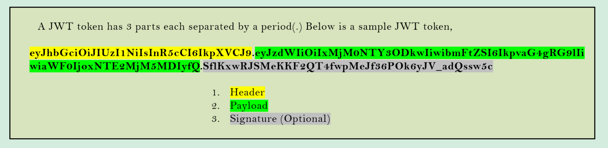

# Spring Security

> *Firewall, HTTPS, SSL faz parte da segurança do server, **Autenticação** e **autorização** é DEVER do developer!*

Course: https://www.udemy.com/course/spring-security-zero-to-master/

Source code: https://github.com/igorgrv/springsecurity6

Spring version:

* Boot: 3.0.6
* Security: 6.0.3
* Java: 17
* Properties doc: https://docs.spring.io/spring-boot/docs/current/reference/html/application-properties.html#appendix.application-properties.security


## spring-boot-starter-security

Quando é instalado a dependencia do spring-boot-security, automaticamente um formulário de login é apresentado no browser e uma senha randomica é exibida no log:

```xml
<dependency>
	<groupId>org.springframework.boot</groupId>
  <artifactId>spring-boot-starter-security</artifactId>
</dependency>
```


 usuário é sempre `user`

* Caso seja acessado via postman, será retornado HTTP 401

### Spring Handling sessions... :thinking:

Se logarmos com o usuário e senha do Spring, podemos fazer refresh diversas vezes na página e o formulário de login não vai ser exibido novamente, mas porquê?

**Spring salva a sessão em memória**, assim ele não pede para que o usuário fique fazendo login a todo momento...

### User and Password

Para não se utilizar da senha randomica e nem do usuário default, é possível setar as `properties` do Spring.

```properties
spring.security.user.password=XXX
spring.security.user.name=XXX
```

# Spring Security Flow


1. Usuário entra com as credentials
2. **`Spring Security Filters`**: Módulo que intercepta todo request ao app e verifica se é necessário autenticação (se sim, direciona o usuário para um form, se não permite a entrada);
3. **`Authentication:`** Através de filtros como o `UsernamePasswordAuthenticationFilter`, é gerado um objeto do tipo `Authentication` que é onde fica as credentials;
4. **`Authentication Manager`:** Chama os Authentications providers responsáveis pela autenticação
5. **`Authentication Providers`:** É onde ficarão as lógicas de como add/update/delete dos usuários e também onde fica a lógica de fazer o hash das senhas
6. **`Security Context`:** Armazena em uma thread o usuário autenticado, ajudando em próximos requests do mesmo usuário


# JSESSIONID

Como o Spring faz para não ficar autenticando o usuário no browser?


1. Quando acessamos a aplicação, o spring irá gravar um `JSESSIONID` - nesse exemplo iniciou-se com `F0E61E3A4F1ECA6A2D481051458A949E`.
2. Quando logamos na aplicação, o Spring irá **gerar um novo JSESSIONID**, e este ficará **gravado em memória**, desta forma o Spring irá saber que esse token/value ja é autorizado - `B1BF57ED30E9A7C87BA65F7AD8F04C21`


# SecurityFilterChain

## permitAll? AnyRequest().authenticated()?

Spring Security, possui uma classe `SpringBootWebSecurityConfiguration` :

```java
@Bean
@Order(SecurityProperties.BASIC_AUTH_ORDER)
SecurityFilterChain defaultSecurityFilterChain(HttpSecurity http) throws Exception {
  http.authorizeHttpRequests().anyRequest().authenticated();
  http.formLogin();
  http.httpBasic();
  return http.build();
}
```

* Por Default, o spring irá para todo request pedir a autenticação e apontar para o formulário
  * `anyRequest().Authenticated().formLogin().httpBasic()` = para todo request, se autentique através do form, pedindo um basicAuth (user e senha);

## Custom Config

### Spring < 5.7 - WebSecurityConfigurerAdapter deprecated

Caso a gente queira mapear qual rota deve ser autenticada ou não, basta implementar a mesma lógica do próprio `SpringBootWebSecurityConfiguration`!

* requestMatchers

```java
@Configuration
public class SecurityConfig {

  @Bean
  SecurityFilterChain defaultSecurityFilterChain(HttpSecurity http) throws Exception {
    return http.authorizeHttpRequests()
        .requestMatchers("/myAccount").authenticated()
        .requestMatchers("/notice").permitAll()
        .and().formLogin()
        .and().httpBasic()
        .and().build();
  }
}
```

### Latest version - Lambdas

Com as novas versões, utilizamos lambdas:

```java
import static org.springframework.security.config.Customizer.withDefaults;

@Configuration
public class SecurityConfig {

  @Bean
  SecurityFilterChain defaultSecurityFilterChain(HttpSecurity http) throws Exception {
    return http
        .authorizeHttpRequests(auth -> {
          auth.requestMatchers("/myAccount").authenticated();
          auth.requestMatchers("/notices", "/contact").permitAll();
        })
        .httpBasic(withDefaults())
        .formLogin(withDefaults())
        .build();
  }

}
```


# CORS 

**CORS**: **C**ross-**O**rigin **R**esource **S**haring


```bash
Access to XMLHttpRequest at 'http://localhost:8080/notices' from origin 'http://localhost:4200' has been blocked by CORS policy: Response to preflight request doesn't pass access control check: It does not have HTTP ok status.
```

* CORS é um protócolo onde os browser verificam se a URL de origim está tentando trocar "recursos" com outra URL.
* É um mecanismo de segurança dos browser, evitando que aplicações de outras URLs façam chamadas no servidor.
* Cenário mais comum: UI (client) tenta se comunicar com o Servidor (backend) - sem uma correta configuração de CORS, os browsers irão bloquear.

## Handling CORS

### CrossOrigin

Para **permitir determinada URL**, temos algums modos de fazer:

* Por método/Class com `@CrossOrigin(origins="http://localhost:3000")`

  ```java
  @CrossOrigin(origins="http://localhost:3000") // vai permitir somente essa rota
  public String myMethod() {}
  
  
  @CrossOrigin(origins="*") // qualquer URL pode acessar
  public String disablingCors() {}

### SecurityFilterChain

Configuração Global dentro do `SecurityFilterChain` usando `cors().configurationSource`

```java
@Bean
SecurityFilterChain defaultSecurityFilterChain(HttpSecurity http) throws Exception {

    http.cors().configurationSource(new CorsConfigurationSource() {
              @Override
              public CorsConfiguration getCorsConfiguration(HttpServletRequest request) {
                  CorsConfiguration config = new CorsConfiguration();
                  config.setAllowedOrigins(Collections.singletonList("http://localhost:4200"));
                  config.setAllowedMethods(Collections.singletonList("*"));
                  config.setAllowCredentials(true);
                  config.setAllowedHeaders(Collections.singletonList("*"));
                  config.setMaxAge(3600L);
                  return config;
              }
          }).authorizeHttpRequests()
                    .requestMatchers("/myAccount").authenticated()
                    .requestMatchers("/welcome").permitAll()
            .and().formLogin()
            .and().httpBasic();
    return http.build();
}
```

### CorsConfigurationSource

Configuração global com `@Bean` + `CorsConfigurationSource`:

```java
@Bean
CorsConfigurationSource corsConfig() {
  List<String> allowedOrigins = new ArrayList<>();
  allowedOrigins.add("http://localhost:4200");

  CorsConfiguration cors = new CorsConfiguration();
  cors.setAllowedOrigins(allowedOrigins);

  cors.setAllowedMethods(Arrays.asList("GET", "POST"));
  cors.setAllowedHeaders(Arrays.asList("*"));
  cors.setAllowCredentials(true);
  cors.setMaxAge(3600L); // tempo para que o CORS faça um refresh
  UrlBasedCorsConfigurationSource source = new UrlBasedCorsConfigurationSource();
  source.registerCorsConfiguration("/**", cors);
  return source;
}

@Bean
SecurityFilterChain defaultSecurityFilterChain(HttpSecurity http) throws Exception {
  return http
      .authorizeHttpRequests(auth -> {
        auth.requestMatchers("/notices").permitAll();
        auth.requestMatchers("/myAccount").authenticated();
      })
      .cors(cors -> cors.configurationSource(corsConfig())) // set the Bean here
      .httpBasic(Customizer.withDefaults())
      .build();
}
```


# CSRF

**CSRF**: **C**ross-**S**ite **R**equest **F**orgery

* CSRF é um tipo de ataque a segurança (diferente de CORS que é uma proteção).

Exemplo:

1. usuário acessa o site X, site X que não possui proteção ao CSRF, irá gerar um cookie com as informações de auth.
2. Após alguns minutos, o mesmo usuário acessa o site Y, que possui um formulário para roubar informações de cookies.
3. Quando o usuário clica no formulário, o site Y rouba o cookie do browser com as infos de auth do site X e realiza requests no site X.
4. Uma vez q o site X não está protegido para CSRF, hackers podem fazer alterações de um outro origin


## Handling CSRF

* Por default o Spring habilita o CSRF, não permitindo que nenhuma requisição (POST/DELETE/PUT) ao servidor altere dados/acesse banco e etc;
* Métodos GET são permitidos (por fazerem fetch do dado);

### Disabling CSRF for all routes

Para desativá-lo (**NÃO RECOMENDADO**) dentro da configuração do `SecurityFilterChain` usamos o **`csrf().disable()`**:

```java
@Bean
SecurityFilterChain securityConfig (HttpSecurity http) throws Exception {
  return http.csrf().disable()....
}
```

### Disabling only public routes

Com `ignoringRequestMatchers` podemos passar a rota que não queremos validar CSRF (geralmente são rotas publicas)

```java
@Bean
SecurityFilterChain securityConfig (HttpSecurity http) throws Exception {
  return http.csrf(csrf -> csrf.ignoringRequestMatchers("/publicRoute"))
}
```


### Using tokens [TODO]

Para rotas que não queremos bloquear, precisamos gerar um token para diferentes requisições


# Authentication Provider

As vezes precisamos fazer **autenticações customizadas**, como:

* Um autenticador para Oauth2 (gmail, facebook);
* Um autenticador para somente usuários acima de 18anos;
* Um autenticador para somente países X;

É **possível ter multiplos Authenticaition Provider**


## Implementando interface Authentication Provider

Para utilizar um Authentication Provider, o Spring nos fornece a interface **Authentication Provider** , que possui 2 métodos:

* **`Authentication authenticate(Authentication authentication)`**:
  * Aqui fica a lógica customizada, que é onde dizemos se o usuário está autenticado ou não
* **`boolean supports(class<?> authentication)`**:
  * É que diz ao Spring se o Autenticador deve ou não ser chamado
  * **Por padrão o Authentication usado é o `UserAndPasswordAuthenticationToken`**


## Authentication p/ Basic Auth

Simples implementação **para validar `basic Auth` do Spring Security**:

* User irá colocar Username + Password
* SecurityConfig irá verificar se a rota está `authenticated` ou `permitAll`
* Caso exista um AuthenticatorProvider (dado o método `supports`) para `UsernamePasswordAuthenticationToken`, este será chamado assim que o basicAuth for inserido.
  * No método `authenticate()` será então resgatado a ROLE do usuário e inserida em um `SimpleGrantedAuthority`, que será usado no `UsernamePasswordAuthenticationToken`

```java
List<GrantedAuthority> authorities = new ArrayList<>();
authorities.add(new SimpleGrantedAuthority(customer.get(0).getRole()));
return new UsernamePasswordAuthenticationToken(username, pwd, authorities);
```

Flow completo:

```java
// Security
@Configuration
public class ProjectSecurityConfig {

    @Bean
    SecurityFilterChain defaultSecurityFilterChain(HttpSecurity http) throws Exception {
        http.csrf().disable()
                        .authorizeHttpRequests()
                        .requestMatchers("/myAccount","/myBalance","/myLoans","/myCards").authenticated()
                        .requestMatchers("/notices","/contact","/register").permitAll()
                .and().formLogin()
                .and().httpBasic();
        return http.build();
    }

    @Bean
    public PasswordEncoder passwordEncoder() {
        return new BCryptPasswordEncoder();
    }

}

// Customer/User
@Entity
public class Customer {

    @Id
    @GeneratedValue(strategy= GenerationType.AUTO,generator="native")
    @GenericGenerator(name = "native",strategy = "native")
    private int id;
    private String email;
    private String pwd;
    private String role;
  
// Login/RegisterController
@RestController
public class LoginController {

    @Autowired
    private CustomerRepository customerRepository;

    @Autowired
    private PasswordEncoder passwordEncoder;

    @PostMapping("/register")
    public ResponseEntity<String> registerUser(@RequestBody Customer customer) {
        Customer savedCustomer = null;
        ResponseEntity response = null;
        try {
            String hashPwd = passwordEncoder.encode(customer.getPwd());
            customer.setPwd(hashPwd);
            savedCustomer = customerRepository.save(customer);
            if (savedCustomer.getId() > 0) {
                response = ResponseEntity
                        .status(HttpStatus.CREATED)
                        .body("Given user details are successfully registered");
            }
        } catch (Exception ex) {
            response = ResponseEntity
                    .status(HttpStatus.INTERNAL_SERVER_ERROR)
                    .body("An exception occured due to " + ex.getMessage());
        }
        return response;
    }
}


// Authentication Provider
@Component
@RequiredArgsConstructor
public class UserAndPasswordProvider implements AuthenticationProvider {

  private final PersonService personService;
  private final PasswordEncoder passwordEncoder;

  @Value("${spring.security.user.password}")
  private String springPass;

  @Override
  public Authentication authenticate(Authentication authentication) throws AuthenticationException {
    String pwd = authentication.getCredentials().toString();

    if (!passwordEncoder.matches(pwd, springPass))
      throw new BadCredentialsException("Invalid password!");

    String userEmail = authentication.getName();
    Optional<Person> userOpt = personService.findByEmailAddress(userEmail);
    if (!userOpt.isPresent())
      throw new BadCredentialsException("No user registered with this details!");

    Person user = userOpt.get();
    List<GrantedAuthority> authorities = new ArrayList<>();
    authorities.add(new SimpleGrantedAuthority(user.getPersonRole()));
    return new UsernamePasswordAuthenticationToken(userEmail, pwd, authorities);
  }

  @Override
  public boolean supports(Class<?> authentication) {
    return (UsernamePasswordAuthenticationToken.class.isAssignableFrom(authentication));
  }

}
```

# Authorization

**401 vs 403!**

* Depois que o usuário se Autenticou, podemos ver as autorizações que ele possui;
* Autorizações podem ser dadas por:
  * ROLES;
    * ADMIN
    * USER
    * MANAGER
  * AUTHORITIES;
    * VIEWACCOUNT
    * VIEWDASHABORD


## Implementando AUTHORITIES

Podemos implementar authorities através de um mapeamento do acesso dos usuários, **relacionamento muitos para um**:

```sql
CREATE TABLE `customer` (
  `customer_id` int NOT NULL AUTO_INCREMENT,
  `name` varchar(100) NOT NULL,
  `email` varchar(100) NOT NULL,
  `mobile_number` varchar(20) NOT NULL,
  `pwd` varchar(500) NOT NULL,
  `role` varchar(100) NOT NULL,
  `create_dt` date DEFAULT NULL,
  PRIMARY KEY (`customer_id`)
);

INSERT INTO `customer` (`name`,`email`,`mobile_number`, `pwd`, `role`,`create_dt`)
 VALUES ('Happy','happy@example.com','9876548337', '$2y$12$oRRbkNfwuR8ug4MlzH5FOeui.//1mkd.RsOAJMbykTSupVy.x/vb2', 'admin',CURDATE());

CREATE TABLE `authorities` (
  `id` int NOT NULL AUTO_INCREMENT,
  `customer_id` int NOT NULL,
  `name` varchar(50) NOT NULL,
  PRIMARY KEY (`id`),
  KEY `customer_id` (`customer_id`),
  CONSTRAINT `authorities_ibfk_1` FOREIGN KEY (`customer_id`) REFERENCES `customer` (`customer_id`)
);

INSERT INTO `authorities` (`customer_id`, `name`)
 VALUES (1, 'VIEWACCOUNT');

INSERT INTO `authorities` (`customer_id`, `name`)
 VALUES (1, 'VIEWCARDS');
```


```java
// Authority
@Entity
@Table(name = "authorities")
public class Authority {

    @Id
    @GeneratedValue(strategy= GenerationType.AUTO,generator="native")
    @GenericGenerator(name = "native",strategy = "native")
    private Long id;

    private String name;

    @ManyToOne
    @JoinColumn(name = "customer_id")
    private Customer customer;
  
  
// Customer
@Entity
public class Customer {

    @Id
    @GeneratedValue(strategy= GenerationType.AUTO,generator="native")
    @Column(name = "customer_id")
    private int id;

    private String name;

    private String role;

    @JsonIgnore
    @OneToMany(mappedBy="customer",fetch=FetchType.EAGER)
    private Set<Authority> authorities;
```


Com as Authorities sendo utilizadas, precisamos definir no **`AuthenticationProvider`** essas authorities;

```java
// Authentication Provider
@Component
@RequiredArgsConstructor
public class UserAndPasswordProvider implements AuthenticationProvider {

  private final PersonService personService;
  private final PasswordEncoder passwordEncoder;

  @Value("${spring.security.user.password}")
  private String springPass;

  @Override
  public Authentication authenticate(Authentication authentication) throws AuthenticationException {
    String pwd = authentication.getCredentials().toString();

    if (!passwordEncoder.matches(pwd, springPass))
      throw new BadCredentialsException("Invalid password!");

    String userEmail = authentication.getName();
    Optional<Person> userOpt = personService.findByEmailAddress(userEmail);
    if (!userOpt.isPresent())
      throw new BadCredentialsException("No user registered with this details!");

    Person user = userOpt.get();
    // não irá mais vir do personRole
    
    // List<GrantedAuthority> authorities = new ArrayList<>();
    // authorities.add(new SimpleGrantedAuthority(user.getPersonRole())); 
    
    List<GrantedAuthority> authorities = getGrantedAuthorities(customer.get(0).getAuthorities());
    return new UsernamePasswordAuthenticationToken(userEmail, pwd, authorities);
  }
  
  private List<GrantedAuthority> getGrantedAuthorities(Set<Authority> authorities) {
        List<GrantedAuthority> grantedAuthorities = new ArrayList<>();
        for (Authority authority : authorities) {
            grantedAuthorities.add(new SimpleGrantedAuthority(authority.getName()));
        }
        return grantedAuthorities;
  }

  @Override
  public boolean supports(Class<?> authentication) {
    return (UsernamePasswordAuthenticationToken.class.isAssignableFrom(authentication));
  }

}
```


E no SecurityConfig conseguimos controlar quais rotas serão acessadas dada a Authority:

* `hasAnyAuthority` -> pode ser mais de um authority
* `hasAuthority`
* `access` -> podemos usar AND / OR

```java
@Configuration
public class ProjectSecurityConfig {

    @Bean
    SecurityFilterChain defaultSecurityFilterChain(HttpSecurity http) throws Exception {
        http.csrf().disable()
                        .authorizeHttpRequests()
                        .requestMatchers("/myAccount").hasAuthority("VIEWACCOUNT")
                        .requestMatchers("/myBalance").hasAnyAuthority("VIEWACCOUNT","VIEWBALANCE")
                        .requestMatchers("/myLoans").hasAuthority("VIEWLOANS")
                        .requestMatchers("/myCards").hasAuthority("VIEWCARDS")
                .and().formLogin()
                .and().httpBasic();
        return http.build();
    }

    @Bean
    public PasswordEncoder passwordEncoder() {
        return new BCryptPasswordEncoder();
    }

}
```


## Implementando ROLES

De forma identifca ao AUTHORITIES, podemos usar ROLES

```sql
CREATE TABLE `customer` (
  `customer_id` int NOT NULL AUTO_INCREMENT,
  `name` varchar(100) NOT NULL,
  `email` varchar(100) NOT NULL,
  `mobile_number` varchar(20) NOT NULL,
  `pwd` varchar(500) NOT NULL,
  `role` varchar(100) NOT NULL,
  `create_dt` date DEFAULT NULL,
  PRIMARY KEY (`customer_id`)
);

INSERT INTO `customer` (`name`,`email`,`mobile_number`, `pwd`, `role`,`create_dt`)
 VALUES ('Happy','happy@example.com','9876548337', '$2y$12$oRRbkNfwuR8ug4MlzH5FOeui.//1mkd.RsOAJMbykTSupVy.x/vb2', 'admin',CURDATE());

CREATE TABLE `authorities` (
  `id` int NOT NULL AUTO_INCREMENT,
  `customer_id` int NOT NULL,
  `name` varchar(50) NOT NULL,
  PRIMARY KEY (`id`),
  KEY `customer_id` (`customer_id`),
  CONSTRAINT `authorities_ibfk_1` FOREIGN KEY (`customer_id`) REFERENCES `customer` (`customer_id`)
);

INSERT INTO `authorities` (`customer_id`, `name`)
 VALUES (1, 'ADMIN');

INSERT INTO `authorities` (`customer_id`, `name`)
 VALUES (1, 'USER');
```

A diferença está no Security:

* `hasAnyRole` -> pode ser mais de um authority
* `hasRole`
* `access` -> podemos usar AND / OR

```java
@Configuration
public class ProjectSecurityConfig {

    @Bean
    SecurityFilterChain defaultSecurityFilterChain(HttpSecurity http) throws Exception {
        http.csrf().disable()
                        .authorizeHttpRequests()
                        .requestMatchers("/myAccount").hasRole("USER")
                        .requestMatchers("/myBalance").hasAnyRole("USER","ADMIN")
                        .requestMatchers("/myLoans").hasRole("USER")
                        .requestMatchers("/myCards").hasRole("USER")
                        .requestMatchers("/user").authenticated()
                        .requestMatchers("/notices","/contact","/register").permitAll()
                .and().formLogin()
                .and().httpBasic();
        return http.build();
    }

    @Bean
    public PasswordEncoder passwordEncoder() {
        return new BCryptPasswordEncoder();
    }

}
```


# Custom Filters

No Spring Security possuímos diversos filters já definidor por ele:

1. DisableEncodeUrlFilter
2. WebAsyncManagerIntegrationFilter
3. Security ContextHolderFilter
4. HeaderWriterFilter
5. CorsFilter CriFilter LogoutFilter
6. UsernamePasswordAuthenticationFilter
7. DefaultLoginPageGeneratingFilter
8. DefaultLogoutPageGeneratingFilter
9. BasicAuthenticationFilter
10. RequestCache AwareFilter
11. SecurityContextHolderAwareRequestFilter
12. Anonymous AuthenticationFilter
13. SessionManagementFilter
14. ExceptionTranslationFilter
15. FilterSecurityInterceptor

Podemos **criar nosso próprio filtro** que irá funcionar entre um desses filtros já criados pelo spring:

```java
.addFilterAfter(new CsrfCookieFilter(), BasicAuthenticationFilter.class)
.addFilterBefore(new MyFilter(), BasicAuthenticationFilter.class)
```


## Criando filtro para log

Vamos dizer que queremos logar as infos do usuário que **conseguiu se autenticar!**

* Precisamos implementar a **interface `Filter`** - que espera um **`doFilter`**

```java
public class AuthoritiesLoggingAfterFilter implements Filter {

  private final Logger LOG = Logger.getLogger(AuthoritiesLoggingAfterFilter.class.getName());

  @Override
  public void doFilter(ServletRequest request, ServletResponse response, FilterChain chain)
      throws IOException, ServletException {

    Authentication authentication = SecurityContextHolder.getContext().getAuthentication();
    if (null != authentication) {
      LOG.info("User " + authentication.getName() + " is successfully authenticated and "
          + "has the authorities " + authentication.getAuthorities().toString());
    }
    chain.doFilter(request, response);
  }

}
```

Então na Security chamamos o `addFilterAfter`

```java
@Configuration
public class ProjectSecurityConfig {

    @Bean
    SecurityFilterChain defaultSecurityFilterChain(HttpSecurity http) throws Exception {
        http.csrf().disable()
                .addFilterAfter(new AuthoritiesLoggingAfterFilter(), BasicAuthenticationFilter.class)
                        .authorizeHttpRequests()
                        .requestMatchers("/myAccount").hasRole("USER")
                        .requestMatchers("/myBalance").hasAnyRole("USER","ADMIN")
                        .requestMatchers("/myLoans").hasRole("USER")
                        .requestMatchers("/myCards").hasRole("USER")
                        .requestMatchers("/user").authenticated()
                        .requestMatchers("/notices","/contact","/register").permitAll()
                .and().formLogin()
                .and().httpBasic();
        return http.build();
    }

    @Bean
    public PasswordEncoder passwordEncoder() {
        return new BCryptPasswordEncoder();
    }

}
```

### OncePerRequestFilter

Existe também um outro tipo de Filtro que `extends` do `GenericFilterBean` (e este implementa `Filter`), o chamado **`OncePerRequestFilter`**:

```java
public class TokenAuthenticationFilter extends OncePerRequestFilter {}
```

Neste cenário, o filtro será executado **somente uma única vez.**

# JWT (JSON Web Token)

Por quê utilizar tokens???

* Com tokens **não precisamos compartilhar as credenciais** em TODOS requests;
* Tokens podem ser invalidados, sem a necessidade de alterar senha do usuário;
* Tokens podem ter uma vida útil;
* Tokens podem ter +informações, como ROLES/AUTHORITIES;
* Podemos usar o token em diversos lugares (gmail para gogle driver, para maps e etc)


## JWT Libraries

```xml
<dependency>
  <groupId>io.jsonwebtoken</groupId>
  <artifactId>jjwt-api</artifactId>
  <version>0.11.5</version>
</dependency>
<dependency>
  <groupId>io.jsonwebtoken</groupId>
  <artifactId>jjwt-impl</artifactId>
  <version>0.11.5</version>
  <scope>runtime</scope>
</dependency>
<dependency>
  <groupId>io.jsonwebtoken</groupId>
  <artifactId>jjwt-jackson</artifactId> 
  <version>0.11.5</version>
  <scope>runtime</scope>
</dependency>
```

## Como JWT funciona

JWT (Json Web Token), irá conter todas as informações necessárias para autenticar o usuário:

* Header -> mostra como está encrypt
* Body -> contem os dados do user
* Signature (opcional) -> aqui fica a segurança




### Signature

O APP fica em um firewall interno? é só usado por aplicações internas?

*  **Se Sim, ele é opcional**.
* Se não, **É MANDATÓRIO**

Como funciona?

* Através de um _hash_ (HMAC SHA256), juntamos: **HEADER + BODY + SECRET**

* A Secret é conhecida **somente pelo backend**

```shell
HMACSHA256(base64UrlEncode(header) + "." + base64UrlEncode(payload), secret)
```

Caso alguém tente mudar o Header / Body, a **Signature** terá que ser alterada também, e é desta forma que somente o backend estará ciente da mudança!


## Removing JSESSSIONID

* **JSESSIONID é um token** gerado automáticamente pelo Spring Security, mas nele não temos nenhuma informação do usuário. Utilizamos JSESSIONID somente para dizer ao Spring Security que determinado user está autenticado e não precisamos ficar mais pedindo credentials a todo momento

Problema do JSESSIONID:

* Não possui nenhum dado do usuário;
* É salvo como cookie no browser para que toda requisição leve ele ao server;
* É passível de ser 'roubado' através de javascript;
* Se o usuário não fechar o browser, o JSESSIONID continua sendo válido até que o server seja reiniciado;


Para remover o JSESSIONID:

1. Necessário informar o spring security que não precisamos mais do JSESSIONID, para isso, iremos utilizar do **`SessionCreationPolicy.STATELESS`**

   ```java
   @Bean
   SecurityFilterChain defaultSecurityFilterChain(HttpSecurity http) throws Exception {
     return http
         .sessionManagement(management -> management.sessionCreationPolicy(SessionCreationPolicy.STATELESS)) // setando stateless
         .authorizeHttpRequests(auth -> {
           auth.requestMatchers("/notices").permitAll();
           auth.requestMatchers("/myAccount").authenticated();
         })
         .cors(cors -> cors.configurationSource(corsConfig()))
         .csrf(csrf -> csrf.ignoringRequestMatchers("contactForm"))
         .httpBasic(Customizer.withDefaults())
         .build();
   }
   ```

2. Permitir que o Cors receba o header `**Authorization**`:

   ```java
   @Bean
     CorsConfigurationSource corsConfig() {
       List<String> allowedOrigins = new ArrayList<>();
       allowedOrigins.add("http://localhost:4200");
   
       CorsConfiguration cors = new CorsConfiguration();
       cors.setAllowedOrigins(allowedOrigins);
   
       cors.setAllowedMethods(Arrays.asList("GET", "POST"));
       cors.setAllowedHeaders(Arrays.asList("Authorization")); // Setando header
       cors.setAllowCredentials(true);
       cors.setMaxAge(3600L);
       UrlBasedCorsConfigurationSource source = new UrlBasedCorsConfigurationSource();
       source.registerCorsConfiguration("/**", cors);
       return source;
     }
   ```

   

## Creating JWT

Necessário:

1. Criar um **`JWTTokenGeneratorFilter extends OncePerRequestFilter`**
   1. Irá gerar o JWT baseado em uma SECRET + HEADER;
2. Criar um **`JWTValidatorFilter extends OncePerRequestFilter`**
   1. Irá validar o token toda vez q houver uma requisição;
3. Alterar o front/client para sempre passar o Header nas requisições;

### JWTTokenGeneratorFilter

Através do `OncePerRequestFilter`, conseguimos filtrar as requisições, mas para isso precisamos declarar na classe `SecurityJavaConfig` o `addFilterAfter` 

```java
@Bean
public SecurityFilterChain filterChain(HttpSecurity http) throws Exception {
  return http
      .sessionManagement(session -> session.sessionCreationPolicy(SessionCreationPolicy.STATELESS))
	    // adicionando filtro
      .addFilterAfter(new JWTTokenGeneratorFilter(), BasicAuthenticationFilter.class) 
      .authorizeHttpRequests(auth -> {
        auth.anyRequest().permitAll();
      })
      .csrf(csrf -> csrf.disable())
      .cors(cors -> cors.configurationSource(corsConfigurationSource()))
      .httpBasic(withDefaults())
      .build();
}
```

Agora na classe **`JWTTokenGeneratorFilter`**:

1. Extender a classe **`OncePerRequestFilter`** - iremos implementar os métodos default
   1. Considerando que este filtro espera um BasicAuth, onde o user será buscado no banco e terá as roles

2. 

```java
// antes de entrar nesse filtro, terá passado pelo AuthenticationProvider
@Component
public class EazyBankUsernamePwdAuthenticationProvider implements AuthenticationProvider {

    @Autowired
    private CustomerRepository customerRepository;

    @Autowired
    private PasswordEncoder passwordEncoder;

    @Override
    public Authentication authenticate(Authentication authentication) throws AuthenticationException {
        String username = authentication.getName();
        String pwd = authentication.getCredentials().toString();
        List<Customer> customer = customerRepository.findByEmail(username);
        if (customer.size() > 0) {
            if (passwordEncoder.matches(pwd, customer.get(0).getPwd())) {
                return new UsernamePasswordAuthenticationToken(username, pwd, getGrantedAuthorities(customer.get(0).getAuthorities()));
            } else {
                throw new BadCredentialsException("Invalid password!");
            }
        }else {
            throw new BadCredentialsException("No user registered with this details!");
        }
    }
  
// então poderá ser gerado o token, uma vez que o usuário já está autorizado
public class JWTTokenGeneratorFilter extends OncePerRequestFilter {

    @Override
    protected void doFilterInternal(HttpServletRequest request, HttpServletResponse response, FilterChain filterChain)
            throws ServletException, IOException {
        Authentication authentication = SecurityContextHolder.getContext().getAuthentication();
        if (null != authentication) {
            SecretKey key = Keys.hmacShaKeyFor(SecurityConstants.JWT_KEY.getBytes(StandardCharsets.UTF_8));
            String jwt = Jwts.builder().setIssuer("Eazy Bank").setSubject("JWT Token")
                    .claim("username", authentication.getName())
                    .claim("authorities", populateAuthorities(authentication.getAuthorities()))
                    .setIssuedAt(new Date())
                    .setExpiration(new Date((new Date()).getTime() + 30000000))
                    .signWith(key).compact();
            response.setHeader(SecurityConstants.JWT_HEADER, jwt);
        }

        filterChain.doFilter(request, response);
    }
```

Após esta etapa precisamos declarar o filtro no `SpringSecurityConfig`:

```java
.addFilterAfter(new JWTTokenGeneratorFilter(), BasicAuthenticationFilter.class)
```


### JWTTokenValidatorFilter

Para validar o token que foi gerado, implementamos outro filtro:

```java
public class JWTTokenValidatorFilter  extends OncePerRequestFilter {

    @Override
    protected void doFilterInternal(HttpServletRequest request, HttpServletResponse response, FilterChain filterChain)
            throws ServletException, IOException {
        String jwt = request.getHeader(SecurityConstants.JWT_HEADER);
        if (null != jwt) {
            try {
                SecretKey key = Keys.hmacShaKeyFor(
                        SecurityConstants.JWT_KEY.getBytes(StandardCharsets.UTF_8));

                Claims claims = Jwts.parserBuilder()
                        .setSigningKey(key)
                        .build()
                        .parseClaimsJws(jwt)
                        .getBody();
                String username = String.valueOf(claims.get("username"));
                String authorities = (String) claims.get("authorities");
                Authentication auth = new UsernamePasswordAuthenticationToken(username, null,
                        AuthorityUtils.commaSeparatedStringToAuthorityList(authorities));
                SecurityContextHolder.getContext().setAuthentication(auth);
            } catch (Exception e) {
                throw new BadCredentialsException("Invalid Token received!");
            }

        }
        filterChain.doFilter(request, response);
    }

    @Override
    protected boolean shouldNotFilter(HttpServletRequest request) {
        return request.getServletPath().equals("/user");
    }

}
```

Então no Security:

```java
.addFilterBefore(new JWTTokenValidatorFilter(), BasicAuthenticationFilter.class)
```


# OAuth2

Quando usar OAuth2? O que é?

* Grandes empresas possuem geralmente 1 único validador, e este será o serviço que irá validar os usuários
* OAuth2 irá validar o usuário sem a necessidade de cada app necessitar possuir senha
* O App pode se integrar com outras aplicações. OAuth2 é geralmente usado pelo gmail, facebook como forma de login
  * Se precisarmos de alguma info do Gmail, e temos o auth2 integrado, já teremos um token para pedir as infos para o gmail

## Oauth2 Types

* **Authorization Code -> Mais comum**
  • PKCE
  • Client Credentials
  • Device Code
  • Refresh Token
  • Implicit Flow (Legacy)
  • Password Grant (Legacy)

## Flow - Authorization Code

Seguindo o tipo `Authorization Code` - comumente precisamos passar alguns parâmetros para o Auth Server:

* `client_id` -> é o ID que o Auth Server cria para o Client;
* `redirect_uri` -> URI que o Auth Server vai redirecionar em caso de sucesso (geralmente apontamos para a segunda chamada que teremos que fazer algo como `https://client.com/token`)
* `scope` -> ficam as Authorities que o user quer acesso
* `state` -> CSRF token
* `response_type` -> é aqui que informamos o oauth2 type, comum a responsta ser `code`

Teríamos algo como:

```bash
https://oauth2-server.com/authorize?client_id=123&redirect_uri=https://client.com/token&scope=photoview&response_type=code
```


Depois de termos o `code` fornecido pelo **Auth Server**, nós temos que fazer outra chamada para pedir o Token!:

* `grant_type` -> indica o tipoe de oauth2 - `authorization_code`
* `code` -> fornece o código que recebemos na primeira chamada
* `client_id / client_secret` -> são as infos que o Auth Server disponibiliza
* `redirect_uri` -> indica a URI do client em caso de sucesso

```bash
https://oauth2-server.com/token?client_id=123&client_secret=321&redirect_uri=https://client.com/home&grant_type=authorization_code&code=4321
```


E então temos finalmente o token do oauth2, que irá vir como JSON


## Implementendo OAuth2 - GIT

```xml
<dependency>
  <groupId>org.springframework.boot</groupId>
  <artifactId>spring-boot-starter-oauth2-client</artifactId>
</dependency>
```

Nas configs do Spring Security, basta usarmos **`oauth2Login`**:

* ` CommonOAuth2Provider` possui algumas interfaces pré-definidas, como:
  * GIT
  * GOOGLE
  * FACEBOOK
  * OKTA

```java
@Bean
SecurityFilterChain defaultSecurityFilterChain(HttpSecurity http) throws Exception {
    http.authorizeHttpRequests().anyRequest().authenticated().and().oauth2Login();
    return http.build();
}

@Bean
public ClientRegistrationRepository clientRepository() {
  ClientRegistration clientReg = clientRegistration();
  return new InMemoryClientRegistrationRepository(clientReg);
}

private ClientRegistration clientRegistration() {
  return CommonOAuth2Provider.GITHUB.getBuilder("github").clientId("8cf67ab304dc500092e3")
      .clientSecret("6e6f91851c864684af2f91eaa08fb5041162768e").build();
}
```


Adicionando Controller que receberá o token:

```java
@Controller
public class SecureController {

    @GetMapping("/")
    public String main(OAuth2AuthenticationToken token) {
        System.out.println(token.getPrincipal());
        return "secure.html";
    }

}
```

