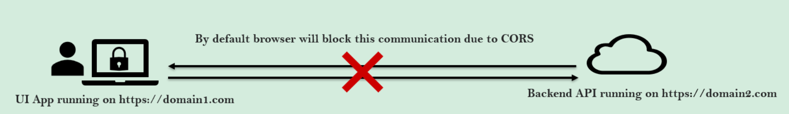

# Spring Security

> *Firewall, HTTPS, SSL faz parte da segurança do server, **Autenticação** e **autorização** é DEVER do developer!*

Course: https://www.udemy.com/course/spring-security-zero-to-master/

Source code: https://github.com/igorgrv/springsecurity6

Spring version:

* Boot: 3.0.6
* Security: 6.0.3
* Java: 17
* Properties doc: https://docs.spring.io/spring-boot/docs/current/reference/html/application-properties.html#appendix.application-properties.security


## spring-boot-starter-security

Quando é instalado a dependencia do spring-boot-security, automaticamente um formulário de login é apresentado no browser e uma senha randomica é exibida no log:

```xml
<dependency>
	<groupId>org.springframework.boot</groupId>
  <artifactId>spring-boot-starter-security</artifactId>
</dependency>
```


 usuário é sempre `user`

* Caso seja acessado via postman, será retornado HTTP 401

### Spring Handling sessions... :thinking:

Se logarmos com o usuário e senha do Spring, podemos fazer refresh diversas vezes na página e o formulário de login não vai ser exibido novamente, mas porquê?

**Spring salva a sessão em memória**, assim ele não pede para que o usuário fique fazendo login a todo momento...

### User and Password

Para não se utilizar da senha randomica e nem do usuário default, é possível setar as `properties` do Spring.

```properties
spring.security.user.password=XXX
spring.security.user.name=XXX
```

# Spring Security Flow


1. Usuário entra com as credentials
2. **`Spring Security Filters`**: Módulo que intercepta todo request ao app e verifica se é necessário autenticação (se sim, direciona o usuário para um form, se não permite a entrada);
3. **`Authentication:`** Através de filtros como o `UsernamePasswordAuthenticationFilter`, é gerado um objeto do tipo `Authentication` que é onde fica as credentials;
4. **`Authentication Manager`:** Chama os Authentications providers responsáveis pela autenticação
5. **`Authentication Providers`:** É onde ficarão as lógicas de como add/update/delete dos usuários e também onde fica a lógica de fazer o hash das senhas
6. **`Security Context`:** Armazena em uma thread o usuário autenticado, ajudando em próximos requests do mesmo usuário


# JSESSIONID

Como o Spring faz para não ficar autenticando o usuário no browser?


1. Quando acessamos a aplicação, o spring irá gravar um `JSESSIONID` - nesse exemplo iniciou-se com `F0E61E3A4F1ECA6A2D481051458A949E`.
2. Quando logamos na aplicação, o Spring irá **gerar um novo JSESSIONID**, e este ficará **gravado em memória**, desta forma o Spring irá saber que esse token/value ja é autorizado - `B1BF57ED30E9A7C87BA65F7AD8F04C21`


# SecurityFilterChain

## permitAll? AnyRequest().authenticated()?

Spring Security, possui uma classe `SpringBootWebSecurityConfiguration` :

```java
@Bean
@Order(SecurityProperties.BASIC_AUTH_ORDER)
SecurityFilterChain defaultSecurityFilterChain(HttpSecurity http) throws Exception {
  http.authorizeHttpRequests().anyRequest().authenticated();
  http.formLogin();
  http.httpBasic();
  return http.build();
}
```

* Por Default, o spring irá para todo request pedir a autenticação e apontar para o formulário
  * `anyRequest().Authenticated().formLogin().httpBasic()` = para todo request, se autentique através do form, pedindo um basicAuth (user e senha);

## Custom Config

### Spring < 5.7 - WebSecurityConfigurerAdapter deprecated

Caso a gente queira mapear qual rota deve ser autenticada ou não, basta implementar a mesma lógica do próprio `SpringBootWebSecurityConfiguration`!

* requestMatchers

```java
@Configuration
public class SecurityConfig {

  @Bean
  SecurityFilterChain defaultSecurityFilterChain(HttpSecurity http) throws Exception {
    return http.authorizeHttpRequests()
        .requestMatchers("/myAccount").authenticated()
        .requestMatchers("/notice").permitAll()
        .and().formLogin()
        .and().httpBasic()
        .and().build();
  }
}
```

### Latest version - Lambdas

Com as novas versões, utilizamos lambdas:

```java
import static org.springframework.security.config.Customizer.withDefaults;

@Configuration
public class SecurityConfig {

  @Bean
  SecurityFilterChain defaultSecurityFilterChain(HttpSecurity http) throws Exception {
    return http
        .authorizeHttpRequests(auth -> {
          auth.requestMatchers("/myAccount").authenticated();
          auth.requestMatchers("/notices", "/contact").permitAll();
        })
        .httpBasic(withDefaults())
        .formLogin(withDefaults())
        .build();
  }

}
```


# CORS 

**CORS**: **C**ross-**O**rigin **R**esource **S**haring



```bash
Access to XMLHttpRequest at 'http://localhost:8080/notices' from origin 'http://localhost:4200' has been blocked by CORS policy: Response to preflight request doesn't pass access control check: It does not have HTTP ok status.
```

* CORS é um protócolo onde os browser verificam se a URL de origim está tentando trocar "recursos" com outra URL.
* É um mecanismo de segurança dos browser, evitando que aplicações de outras URLs façam chamadas no servidor.
* Cenário mais comum: UI (client) tenta se comunicar com o Servidor (backend) - sem uma correta configuração de CORS, os browsers irão bloquear.

## Handling CORS

### CrossOrigin

Para **permitir determinada URL**, temos algums modos de fazer:

* Por método/Class com `@CrossOrigin(origins="http://localhost:3000")`

  ```java
  @CrossOrigin(origins="http://localhost:3000") // vai permitir somente essa rota
  public String myMethod() {}
  
  
  @CrossOrigin(origins="*") // qualquer URL pode acessar
  public String disablingCors() {}

### SecurityFilterChain

Configuração Global dentro do `SecurityFilterChain` usando `cors().configurationSource`

```java
@Bean
SecurityFilterChain defaultSecurityFilterChain(HttpSecurity http) throws Exception {

    http.cors().configurationSource(new CorsConfigurationSource() {
              @Override
              public CorsConfiguration getCorsConfiguration(HttpServletRequest request) {
                  CorsConfiguration config = new CorsConfiguration();
                  config.setAllowedOrigins(Collections.singletonList("http://localhost:4200"));
                  config.setAllowedMethods(Collections.singletonList("*"));
                  config.setAllowCredentials(true);
                  config.setAllowedHeaders(Collections.singletonList("*"));
                  config.setMaxAge(3600L);
                  return config;
              }
          }).authorizeHttpRequests()
                    .requestMatchers("/myAccount").authenticated()
                    .requestMatchers("/welcome").permitAll()
            .and().formLogin()
            .and().httpBasic();
    return http.build();
}
```

### CorsConfigurationSource

Configuração global com `@Bean` + `CorsConfigurationSource`:

```java
@Bean
CorsConfigurationSource corsConfig() {
  List<String> allowedOrigins = new ArrayList<>();
  allowedOrigins.add("http://localhost:4200");

  CorsConfiguration cors = new CorsConfiguration();
  cors.setAllowedOrigins(allowedOrigins);

  cors.setAllowedMethods(Arrays.asList("GET", "POST"));
  cors.setAllowedHeaders(Arrays.asList("*"));
  cors.setAllowCredentials(true);
  cors.setMaxAge(3600L); // tempo para que o CORS faça um refresh
  UrlBasedCorsConfigurationSource source = new UrlBasedCorsConfigurationSource();
  source.registerCorsConfiguration("/**", cors);
  return source;
}

@Bean
SecurityFilterChain defaultSecurityFilterChain(HttpSecurity http) throws Exception {
  return http
      .authorizeHttpRequests(auth -> {
        auth.requestMatchers("/notices").permitAll();
        auth.requestMatchers("/myAccount").authenticated();
      })
      .cors(cors -> cors.configurationSource(corsConfig())) // set the Bean here
      .httpBasic(Customizer.withDefaults())
      .build();
}
```


# CSRF

**CSRF**: **C**ross-**S**ite **R**equest **F**orgery

* CSRF é um tipo de ataque a segurança (diferente de CORS que é uma proteção).

Exemplo:

1. usuário acessa o site X, site X que não possui proteção ao CSRF, irá gerar um cookie com as informações de auth.
2. Após alguns minutos, o mesmo usuário acessa o site Y, que possui um formulário para roubar informações de cookies.
3. Quando o usuário clica no formulário, o site Y rouba o cookie do browser com as infos de auth do site X e realiza requests no site X.
4. Uma vez q o site X não está protegido para CSRF, hackers podem fazer alterações de um outro origin


## Handling CSRF

* Por default o Spring habilita o CSRF, não permitindo que nenhuma requisição (POST/DELETE/PUT) ao servidor altere dados/acesse banco e etc;
* Métodos GET são permitidos (por fazerem fetch do dado);

### Disabling CSRF for all routes

Para desativá-lo (**NÃO RECOMENDADO**) dentro da configuração do `SecurityFilterChain` usamos o **`csrf().disable()`**:

```java
@Bean
SecurityFilterChain securityConfig (HttpSecurity http) throws Exception {
  return http.csrf().disable()....
}
```

### Disabling only public routes

Com `ignoringRequestMatchers` podemos passar a rota que não queremos validar CSRF (geralmente são rotas publicas)

```java
@Bean
SecurityFilterChain securityConfig (HttpSecurity http) throws Exception {
  return http.csrf(csrf -> csrf.ignoringRequestMatchers("/publicRoute"))
}
```


### Using tokens [TODO]

Para rotas que não queremos bloquear, precisamos gerar um token para diferentes requisições


# JWT (JSON Web Token)

JWT Libraries

```xml
<dependency>
  <groupId>io.jsonwebtoken</groupId>
  <artifactId>jjwt-api</artifactId>
  <version>0.11.5</version>
</dependency>
<dependency>
  <groupId>io.jsonwebtoken</groupId>
  <artifactId>jjwt-impl</artifactId>
  <version>0.11.5</version>
  <scope>runtime</scope>
</dependency>
<dependency>
  <groupId>io.jsonwebtoken</groupId>
  <artifactId>jjwt-jackson</artifactId> 
  <version>0.11.5</version>
  <scope>runtime</scope>
</dependency>
```


## Removing JSESSSIONID

* **JSESSIONID é um token** gerado automáticamente pelo Spring Security, mas nele não temos nenhuma informação do usuário. Utilizamos JSESSIONID somente para dizer ao Spring Security que determinado user está autenticado e não precisamos ficar mais pedindo credentials a todo momento

Problema do JSESSIONID:

* Não possui nenhum dado do usuário;
* É salvo como cookie no browser para que toda requisição leve ele ao server;
* É passível de ser 'roubado' através de javascript;
* Se o usuário não fechar o browser, o JSESSIONID continua sendo válido até que o server seja reiniciado;


Para remover o JSESSIONID:

1. Necessário informar o spring security que não precisamos mais do JSESSIONID, para isso, iremos utilizar do **`SessionCreationPolicy.STATELESS`**

   ```java
   @Bean
   SecurityFilterChain defaultSecurityFilterChain(HttpSecurity http) throws Exception {
     return http
         .sessionManagement(management -> management.sessionCreationPolicy(SessionCreationPolicy.STATELESS)) // setando stateless
         .authorizeHttpRequests(auth -> {
           auth.requestMatchers("/notices").permitAll();
           auth.requestMatchers("/myAccount").authenticated();
         })
         .cors(cors -> cors.configurationSource(corsConfig()))
         .csrf(csrf -> csrf.ignoringRequestMatchers("contactForm"))
         .httpBasic(Customizer.withDefaults())
         .build();
   }
   ```

2. Permitir que o Cors receba o header `**Authorization**`:

   ```java
   @Bean
     CorsConfigurationSource corsConfig() {
       List<String> allowedOrigins = new ArrayList<>();
       allowedOrigins.add("http://localhost:4200");
   
       CorsConfiguration cors = new CorsConfiguration();
       cors.setAllowedOrigins(allowedOrigins);
   
       cors.setAllowedMethods(Arrays.asList("GET", "POST"));
       cors.setAllowedHeaders(Arrays.asList("Authorization")); // Setando header
       cors.setAllowCredentials(true);
       cors.setMaxAge(3600L);
       UrlBasedCorsConfigurationSource source = new UrlBasedCorsConfigurationSource();
       source.registerCorsConfiguration("/**", cors);
       return source;
     }
   ```

   

## Creating JWT

Necessário:

1. Criar um **`JWTTokenGeneratorFilter extends OncePerRequestFilter`**
   1. Irá gerar o JWT baseado em uma SECRET + HEADER;
2. Criar um **`JWTValidatorFilter extends OncePerRequestFilter`**
   1. Irá validar o token toda vez q houver uma requisição;
3. Alterar o front/client para sempre passar o Header nas requisições;

### JWTTokenGeneratorFilter

Através do `OncePerRequestFilter`, conseguimos filtrar as requisições, mas para isso precisamos declarar na classe `SecurityJavaConfig` o `addFilterAfter` 

```java
@Bean
public SecurityFilterChain filterChain(HttpSecurity http) throws Exception {
  return http
      .sessionManagement(session -> session.sessionCreationPolicy(SessionCreationPolicy.STATELESS))
      .addFilterAfter(new JWTTokenGeneratorFilter(), BasicAuthenticationFilter.class) // adicionando filtro
      .authorizeHttpRequests(auth -> {
        auth.anyRequest().permitAll();
      })
      .csrf(csrf -> csrf.disable())
      .cors(cors -> cors.configurationSource(corsConfigurationSource()))
      .httpBasic(withDefaults())
      .build();
}
```

Agora na classe **`JWTTokenGeneratorFilter`**:

1. Extender a classe **`OncePerRequestFilter`** - iremos implementar os métodos default

```java
```

