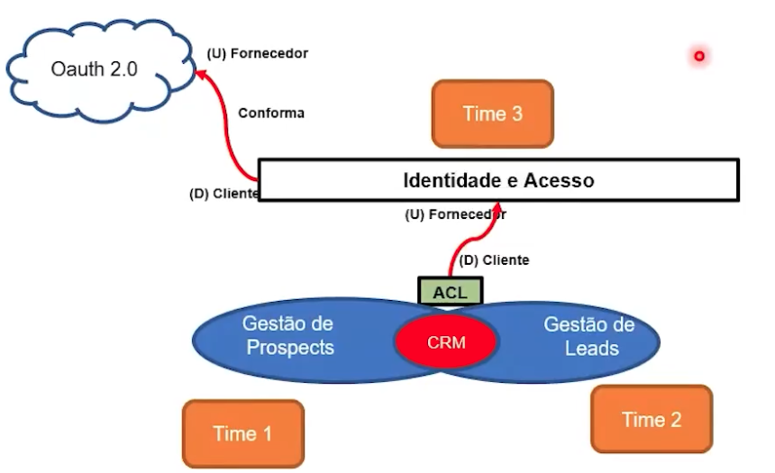

# Pós - Arquitetura e Desenvolvimento Java

## Lives

* Canivete Suiço? Quais ferramentas escolher para o dia a dia de um backend. :heavy_check_mark:
  *  https://zoom.us/rec/share/yyeoHiEZ6clMt3Qi4to4hJwRLxnJOkVdpBDQmQECiW5W8NCELYBLLsR7ex1t59lz.CJ0xaB8vht5RSf3A  
  * `7h3\*Xm@N`
* SOAP vs REST vs gRPC: Qual devo usar para criar a API :heavy_check_mark:
  * https://zoom.us/rec/share/tQEJjH2DdiQ0IxkkOg_rEv7SPNdKzQegzsauiQXj5VsxtxluTD7s6lSYQcw2OX59.eElEMw44ytxmQIAI  
  * `!R2B4H%$`
* LIVE EXTRA - Projeto Coda Comigo -  Utilização do Lombok/Validação com Bean Validation :heavy_check_mark:
  * https://zoom.us/rec/share/lhQpqQa31owzO6Qta7jZxUQAci7FcpoomeSa6iH7GMm40rMgPfLGrpEjCKVTv3D3.dFGDEikLo7AjRaqk?startTime=1686783690000
  * `$=AZ6&.H`
*  LIVE EXTRA - Projeto Coda Comigo - DTO/Records :heavy_check_mark:
  * https://zoom.us/rec/share/u0cY9y-15Qfm7E_iqotPxzdG5Q73fjwWEeHMa15W0LjZv9LKqDlPIEL3mpXXuble.82l50Sh6L0hFEKDw?startTime=1687387944000
  * `8&7%wd#O`

* LIVE EXTRA - Projeto Coda Comigo - Testes Unitários e Validação de Beans :heavy_check_mark:
  * https://zoom.us/rec/share/vhCyPyXU6B6TAxdHAiXIsJsQgqf3cluIjkWWBnAwfB4cOkVByDABprKLz7suL3kl.BtvHrx32KkWvbp7b 
  * `8*%SH^HE`

* Live de Persistência 1: Introdução ao SQL e PostgresSQL :heavy_check_mark:
  * https://zoom.us/rec/share/XO_PSbk7B6JdkGTgvP8c2JgheEntsnKkokjdb4X-dTPfYvX9P1D0TkyS-yDZfIo0.Pl_H1WY4q-VOA7dq 
  * `28cC+%x0`

* Live de Persistência 2: Mapeamento de Entidades JDBC :heavy_check_mark:
  * https://zoom.us/rec/share/Jr92C0GFQ_RaTXi61m4kxzPNVvPSXoFGyNOQvPJqU6vfQOvGiI3hTXdflvlexu4R.p_zpC_r38RoSjcwj 
  * `Q3.j@rqa`
* Live de Persistência 3 + 4: Consultas com Spring JPA + Relacionamentos :heavy_check_mark:
  * [https://zoom.us/rec/share/1rzC337hD5Xwo-CpstiaHAaNA3Ml_lieRx-9ZdgJnqmvlAY4l3JrRj4ccP6qMqHR.Iqj0gaZqqu9Dw13_](https://zoom.us/rec/share/1rzC337hD5Xwo-CpstiaHAaNA3Ml_lieRx-9ZdgJnqmvlAY4l3JrRj4ccP6qMqHR.Iqj0gaZqqu9Dw13_)
  * `=aq!B2Y9`

* Live de Persistência 5: Relacionamentos One to One e One to Many no JPA
  * https://zoom.us/rec/share/HSUMl9Jsz1cO74hl799NmphzDKgAsu6EM4Fn2ZzjDY31ppChhwnDKv8rNxkn59D_.S8DqwjyPY1J7Ld3i 
  * `g4c!dS?Z`


## April 27 - Aula Inaugural 00

* Gustavo Genari - CEO FIAP
* Paulo Vieira - CEO Alura
* Adriano Almeida - COO Alura
* Andrea Paiva - Head/Diretora MBA On
* Vlad Cruz - Professor
* Cassio Oliveira - Coordenador

Curso dividido em 5 fases. No Final do curso haverá um desafio final com tudo que foi aprendido, com **hackathon**.

1. Primeiros passos com Spring
2. DDD e testes automatizados
3. Requisitos, portabilidade e qualidade de Software
4. Deploy e mensageria
5. Spring JPA e desenvolvimento seguro

Aulas:

* Cada 15 dias tem live

Testes:

* Fast Test - Questões de múltipla escolha
* Desafio - final de fase
  * E.g: Construir um app para cadastro de cliente (interface)
  * Webservice / Persistencia
* Hackathon
* Fase 5 é necessário ir presencial, marcar

Notas:

* Fast Test
* Tech Challenge
* Hackaton
* Atividade Presencial


**Desafio 1**

https://forms.office.com/pages/responsepage.aspx?id=4r_bEbiJSUW-EM7DZOWVUcuxE3m2i81CkgE7F-PZ4k5UMFY4RTVZR0FKTlNKN1IwRTUzMVdLREkzRi4u

* 70 questões múltipla escolha, conceito, leutura e intepretação de código
  * 1 só correta
  * Pesos diferentes
  * 20:45 - termina


# Fase 1 - First Steps w/ Spring

Projeto git: https://github.com/FIAP/PostTech_Java_AluraBank

## Aula 1 - Motivação & REST & HTTP

* HTTP são todas conexões que realizamos em um browser para acessar um site;
* Para acessar uma requisição HTTP precisamos:
  * Tipo de requisição:
    * HTTP é o tipo de requisição - HTTPS é a requisição HTTP + Protocolo SSL de criptografia;
  * Endereço da requisição:
    * Todo servidor possui um número global, que quando acessado um domínio (google) é direcionado para o número 123.456.789
* **Response**: resposta do servidor
* **Header**: Utilizado na requisição para passar mais informação, como o tipo de resposta (JSON/TEXT/XML), Token de autenticação. Todo header tem um tamanho máximo default por servidor (tomcat é 8kb).
* **APIs**: Application Programming Interface, é um mecanismo que permite que duas aplicações de linguagens distintas se comuniquem, mas para isso uma série de definições e protocólos sejam definidos nas requisições e respostas
  * Tipos de APIs:
    * **SOAP**: client e sevidor utilizam XML para trocar dados;
    * **RPC**: Remote Procedure Call - permite que um app chame procedimento de outra função;
    * **Websocket**: conexão bidrecional entre servidor e cliente, para trocarem informações (jogos e chats);
    * **REST**: Transferencia Representacional de Estado - Cliente solicita informações ao servidor, que o processa e devolve para o cliente;
      * Benefícios:
        * Integração
        * Inovação
        * Expansão
        * Facilidade de Manutenção

```bash
Resumo da aula part 1:

Professor Rodrigo Vieira e o Paulo Silveira apresentaram o funcionamento de uma comunicação HTTP.
Assim como os seres humanos conversam entre si em uma linguagem que ambos entender, assim funciona os computadores.

Um protocólo serve para ambos conversarem, onde uma:
- Requisição
- Resposta
Devem acontecer...

Por padrão quando acessamos uma página, fazemos:
- Verbo HTTP (GET)
- Endereço (https://xxxxxx.com.br) -> URL (nome único) Uniform Resource Locator
- Body + header (opcionais)

Retorno:
- Status code (200, 404, 302)
- Response

Para testar podemos fazer via cURL

curl -i -X GET https://alura.com.br
-i -> queremos detalhes
-X -> método HTTP

Algumas requisições são bloqueadas por falta de certificado
```

```bash
Resumo da aula parte 2:

GET com parâmetros pode ser feito com o curl tbm
➜  ~ curl -i -X GET "https://postman-echo.com/get?nome=igor&idade=27"
HTTP/2 200
date: Thu, 04 May 2023 01:03:20 GMT
content-type: application/json; charset=utf-8
content-length: 354
etag: W/"162-hbyVcNEljpowYSxiiK4cobBye+g"
set-cookie: sails.sid=s%3AiMVw_ReiXxsiUvrEo1R2fPfIfNBETTOC.Fq76U4YkBbBbpRWH5e3DCcocmkrEJAVz7ssXQd5Hz7E; Path=/; HttpOnly

{
  "args": {
    "nome": "igor",
    "idade": "27"
  },
  "headers": {
    "x-forwarded-proto": "https",
    "x-forwarded-port": "443",
    "host": "postman-echo.com",
    "x-amzn-trace-id": "Root=1-64530458-439776466e260d2a564c0cf4",
    "user-agent": "curl/7.87.0",
    "accept": "*/*"
  },
  "url": "https://postman-echo.com/get?nome=igor&idade=27"
}%


Para fazer POST também podemos passar parâmetros com o curl, iremos passar outros valores:
-d -> para o body
-H -> para o Header

➜  ~ curl -i -X POST https://postman-echo.com/post -H "Content-Type:application/json" -d '{"chave1":"value1","chave2":"value2"}'
HTTP/2 200
date: Thu, 04 May 2023 01:09:37 GMT
content-type: application/json; charset=utf-8
content-length: 520
etag: W/"208-s4iYVSWcMJoCJA9nf9ZLn5k6a8E"
set-cookie: sails.sid=s%3AumBo_JZDgxovCUB_XrY1-wxA0udgcuNx.Xo0kdWh1LjGmbTgtw0kLst7Dr%2B9neQJUJePBc092Gg0; Path=/; HttpOnly

{
  "args": {},
  "data": {
    "chave1": "value1",
    "chave2": "value2"
  },
  "files": {},
  "form": {},
  "headers": {
    "x-forwarded-proto": "https",
    "x-forwarded-port": "443",
    "host": "postman-echo.com",
    "x-amzn-trace-id": "Root=1-645305d1-60d7361e3061a4bf07d6cd95",
    "content-length": "37",
    "user-agent": "curl/7.87.0",
    "accept": "*/*",
    "content-type": "application/json"
  },
  "json": {
    "chave1": "value1",
    "chave2": "value2"
  },
  "url": "https://postman-echo.com/post"
}%
```

Status Codes: https://httpcats.com/


## Aula 2 - Spring

* Spring foi criado pela empresa Pivotal, como um projeto java open source
* Objeto principal era facilitar o desenvolvimento, implementando o conceito de **injeção de dependência + inversão de controle.**
  * Surgiu para substituir o então **J2EE**, que era bom para criação de aplicações.
* Spring não precisa de um **servidor de aplicação** para funcionar;
* Spring podemos criar aplicações **reativas, batchs, web apps, apps cloud, apps serveless**;


### Projetos Spring

* **Spring Boot**: forma mais rápida de criação de apps;
  * Cria apps stand-alone;
  * Internaliza servidores de aplicação como tomcat, jetty (sem precisar do war);
  * Configura automaticamente o Spring e libs terceiros
  * Sem necessidade de códigos ou xml;
* **Spring Framework:** é o core para injeção de dependencias, webapps;
* **Spring Data:** feito para lidar com banco de dados relacionais, não relacionais, cloud;
* **Spring Security:** framework para autenticação e autorização, customizável;


### Spring Boot

* Para que o Spring Boot funcione, é necessario 4 tipos de componentes:
  * **Spring Boot Starter:** Combina várias bibliotecas em uma só, sem que aja a necessidade de adicionar várias dependências. Exemplo, quando adicionamos o spring mvc, já adicionamos também o web, core, mvc e servlet API.
  * **Spring Boot CLI:** CLI é utilizado como uma linha de comando para iniciar o Spring Starter e AutoConfigurator
  * **Spring Boot AutoConfigurator:** gerencia as configurações do Spring, permitindo configurações personalizadas;
  * **Spring Boot Actuator:** Prove os endpoints e as métricas + responsável por definir que o servidor fique exposto na porta XYZ;


### Spring Initializr

* É uma ferramenta que ajuda na criação de um projeto Spring Boot - https://spring.io/projects
* Para utiliza-lo precisamos definir:
  * Maven ou Gradle
  * Java ou Kotlin
  * Versão do Spring Boot
  * Empactamento:
    * **JAR** (Java Archive) - mais usual, é um zip com as bibliotecas utilizadas no projeto, utilizada em outros projetos java;
    * **WAR** (Web Application Archive) - é um zip voltado para web, muito usado pelo antigo **Tomcat**;
  * Dependências (Spring MVC, WEB, REACTIVE, CLOUD, DATA);


### Como era sem o Spring...

A injeção de dependências foi o que tornou o Spring tão popular. Antes do Spring, era muito comum o uso de um padrão chamado **REGISTRY**, onde a idéia é criar uma classe `static` que **fabrica os objetos**.

```java
public class Registry {
  
  public static final Evento getEvento() {
    return new Evento(getEscola(), new LocalDoEvento());
  }
  
  public static final Escola getEscola() {
    return new Escola();
  }
}
```

* O Registry tende a crescer conforme mais classes são criadas;
* O Registry permite o uso Global das classes (má prática e grande problema nos apps mais antigos) - já que basta chamal-lo e teremos acesso a classe;
* Favore o **acoplamento!**
  * ***Se sua classe possui vários imports de classes diferenetes do projeto, ISSO É SINAL DE ACOPLAMENTO!***

#### @Component

Basicamente, invés de **termos o registry, o Spring veio com um simples `@Component`** para resolver a injeção das dependencias!

* @Component é anotação mais básica, que pede ao Spring ***Gerencie para mim essa classe/injete automaticamente ela***

## Aula 3 - Gerenciador de dependências

* Quando temos uma série de classes que fazem sentido entre si, podemos **considera-la do mesmo pacote!**
* O uso de biblioteca veio para validar o termo **para que recriar a roda?** Se alguém já desenvolveu determinada função, basta implementar-los ela;
* **Problema dos pacotes antigamente:** 
  * quando usamos muito e precisamos atualiza-los, como fazemos? temos que ir manualmente em cada pacote e ir atualizando cada um deles :sweat:
  * Uma biblioteca precisa de outra, que precisa de outra e assim por diante...
* Os gerenciadores de dependencia/pacotes vieram para resolver este problema.
  * **Java: Maven / Gradle**
  * Javascript: NPM / Yarn
  * .NET: NuGet
  * Python: PIP

### Maven

Desenvolvido pela **Apache**, maven através do arquivo **pom (Project Object Model)** pode configurar todas as dependências do projeto;

* Maven segue o **`CoC`** (**Convention over Configuration**) - que estipula um padrão de estrutura para cada folder, onde o maven já sabe onde procurar os files
* Os arquivos baixados pelo maven ficam dentro do diretório **`.m2`**;
* Ciclos:
  * **`mvn compile` -> Gera os . class**
  * `mvn test`
  * **`mvn package` -> Gera o Jar**
  * **`mvn install` -> Roda todos steps anteriores**
* Arquivos gerados pelo maven vão para pasta `target` do projeto;
* Se executarmos um `java -jar fileCriadoPeloMaven.jar` será iniciado o projeto;

**Pros**:

* Gerenciador Java **mais conhecido e mais antigo**;
* Maior parte dos projetos utilizam;
* Fácil de ler (XML);
* Processo de build simplificado (`man package` | `mvn install`)

**Cons:**

* Necessita instalação ( `brew install mvn`);
* Díficil de escrever (por ser XML);

### Gradle

Desenvolvido pela **Gradle**, junta as mesmas dependências do **Maven e Ivy**.

* Utilizado em **projetos Android**;
* Utiliza a linguagem **Groovy**; (ou seja precisa saber uma nova linguagem para criar o arquivo)

```groovy
apply plugin: 'java' 
apply plugin: 'eclipse' 
apply plugin: 'application' 

mainClassName = 'hello.HelloWorld' 

repositories { 
  mavenCentral() 
} 

jar { 
  archiveBaseName = 'gs-gradle' 
  archiveVersion = '0.1.0' 
}

sourceCompatibility = 1.8 
targetCompatibility = 1.8 
dependencies { 
  implementation "joda-time:joda-time:2.2" 
  testImplementation "junit:junit:4.12" 
}
```


## Aula 4 - Coesão e Acoplamento

*Um projeto precisa ser entregue, porém sempre com qualidade! Um fator determinante é a **coesão e acoplamento.*** Alguns projetos não se preocupam com a reutilização de códigos, **mas na orientação a objetos este é o tema central!**

* **Acoplamento:**
  * O quanto um **componente depende do outro** é o que define o **grau de acoplamento**.
  * **Componente depende muito de outro = Alto acoplamento; :x:**
  * **Problema:** difícil de dar manutenção, uma alteração pode ter um efeito cascata em outros componentes.
  * **Tipos:**
    * **Desenvolvimento:** Um componente depende do outro, podendo gerar um **efeito cascata**;
    * **Semântica**: Quando 2 componentes compartilham do mesmo conceito no projeto;
    * **Funcional**: Quando 2 componentes precisam executar juntos uma função;
    * **Incidental**: Quando 2 componentes estão juntos sem uma real necessidade;
    * **Operacional**: Quando um componente precisa de outro para realizar uma tarefa;
* **Coesão:**
  * Se o **acoplamento se preocupa com o externo** (relação entre 2+ componentes), a **coesão se preocupa com o interno**, ou seja, o que aquele componente X está fazendo.
  * Pensando no UNO, imagine que a carta **6 vermelha tem uma única função!** Tem uma cor + número... mas como seria se uma carta pudesse mudar de cor, número e fizesse outras coisas?
  * **Componente com muita responsabilidade = Baixa coesão;** :x:


## Aula 6 - Annotations

* No Java os primeiros ***metadados*** foram criados para preenchimento da **javadoc.** 

* A partir do JSR 175, foram introduzidas as ***annotations*** (defindas pelo **`@`**), que permitiam que metadados fossem atribuídos a métodos, classes, campos, parâmetros e etc;

* Spring faz muito o uso das annotations, como em:

  * `@RestController` -> Indica que se trata de uma classe que para uma API Rest;

  * `@RequestMapping` -> endereço da API

  * `@JsonProperty` -> Informa ao Spring que deverá ser feito um binding do parâmetro para json

    * ```java
      public class myEntity {
        
        @JsonProperty
        private String name;
        
        @JsonProperty
        private int age;
      }
      
      // { name:'igor', age: 27}

## Aula 7 - MVC

* Quando pensamos que um **projeto poderá sofrer alterações no futuro**, ou quando pensamos em **qualidade**, o padrão mais conhecido é o **MVC (Model View Controller)**.
  * **Controller**: Cuida das rotas;
  * **View**: O que é apresentado ao usuário;
  * **Model**: É o objeto, onde fica a regra de negócio;
* Criado em 1970, para projetos visuais.
* Controller recebe a requisição, chama a camada de negócio (Model) e então devolve uma View;


**MUITOS PROJETOS NÃO DIVIDEM BEM A LÓGICA DE NEGÓCIO E TECNOLOGIA**!

* Lógica de negócio **DEVE ficar na classe de domínio!**
* Lógica de tecnologia, deve ficar nas classes Services/Controllers

# Fase 1 - Criação de API Rest w/ SpringBoot

## Aula 1 - Chamando a API

* Existem algumas formas de se "chamar" uma API, o GET talvez seja o mais simples, **podemos utilizar o próprio browser!** porém não podemos utilizar os outros métodos HTTP;
  * O Chrome possui plugins para chamadas REST, como o ***Advanced Rest Client***.
* Quer fazer **via terminal? Existe o CURL!** Porém, é massivo ficar digitando os comandos...
* Softwares? Temos **Postman & Insomnia**! User friendly, quer nos permite fazer todas chamadas, salva-las em collections e etc...

## Aula 2 - Injeção de dependência

* Antes de falar sobre injeção de dependência, precisamos entender ***O quê é uma dependência?***
  * **Dependência é um objeto do qual OUTRO objeto depende!** simples assim :smiley:
* Quando de como uma dependência é utilizada, **pode ficar muito difícil dar manutenção**. Para isso foi criado a chamada ***Injeção de dependência***, que **remove o acoplamento** entre objetos/dependentes.


### Sem injeção de dependência

Dado o exemplo:

```java
public class MyService {
  
  private CalculadoraDeImpostosNacionais calculadora = new CalculadoraDeImpostosNacionais();
  
  public BigDecimal calculaImposto(int valor) {
    return this.calculadora.calcula(valor);
  }
}
```

* `MyService` **depende** da classe `CalculadoraDeImpostosNacionais`, pq para executar o `calculaImposto` se faz necessário utilizar o método `calcula` da `CalculadoraDeImpostosNacionais`.

  * O que aconteceria se precissássemos de mais calculadoras? **Talvez `MyService` pudesse receber no construtor a Calculadora?** Sim, mas o ideal seria com uma interface, **pois a interface não exige que seja instanciada,**  tirando assim a **dependência de `MyService` da `Calculadora`**

    ```java
    public interface CalculadoraDeImpostos {
      BigDecimal calcula(int valor);
    }
    ```

    ```java
    public class MyService {
      
      private CalculadoraDeImpostos calculadora;
      
      // constructor
      // quem quiser usar MyService, pode passar a classe que quiser que implemente a interface...
      public MyService(CalculadoraDeImpostos calculadora) {
        this.calculadora = calculadora;
      }
      
      public BigDecimal calculaImposto(int valor) {
        return this.calculadora.calcula(valor);
      }
    }
    ```


### W/ Injeção de dependência - Autowired

* O Spring lida com a injeção de forma diferente. Através de containers chamado `Spring IoC`. Ele consegue manipular todas as dependências.

* **`@Autowired`** (ponto de dependência) -> pode ser utilizada e atributos/Setters

  * ```java
    @Service
    public class MyService {
      
      @Autowired
      private CalculadoraDeImpostos calculadora;
      
      public BigDecimal calculaImposto(int valor) {
        return this.calculadora.calcula(valor);
      }
    }


## Aula 3/4 - DTOs

* DTO ou ***Data Transfer Object*** é nada mais do que uma **abstração da regra de negócio/entidade**.

* Porque usar?

  * Imagine a classe ***User***:

  * ```java
    public class User {
      private String name;
      private Integer age;
      private boolean admin;
    }
    ```

  * Imaginando que temos um controller que salva o usuário, poderíamos **deixar vulnerável nosso sistema**, pois um hacker poderia "tentar" simular no JSON que temos um parametro chamado ***admin*** :thinking:

  * ```json
    {
      'name': 'Igor',
      'age': 27,
      'admin': true
    }
    ```

  * Com o uso de DTO podemos abstrair o parâmetro `admin` , fazendo assim, com que mesmo que seja passado admin no JSON, ele será **ignorado!**

  * ```java
    public record UserDTO(String name, Integer age){}
    ```


Como bom padrão para o DTO, devemos coloca-lo **próximo a Controller!** E seguindo o principío SOLID, o DTO será responsável em retornar a Entidade!

```java
//DTO
public record UserDTO(String name, Integer age){
  
  public User toUser() {
    return new User(name, age)
  }
}


//ENTITY
public class User {
  private String name;
  private Integer age;
  private boolean admin;
  
  public User(String name, Integer age) {
    this.name = name;
    this.age = age;
  }
}
```


# Fase 2 - DDD e Tests

Fast-test:

1. E
2. E
3. E
4. E
5. B

## Aula 1 - Intro Domain Driven Design

* DDD (*Domain Driven Design*) é uma **padrão de design de software**.
* **NÃO PRECISAMOS USAR TUDO DO DDD**;
* Nos ajuda **não sair escrevendo código SEM PLANEJAMENTOS**; (**GOHORSE!**)
* Enfatiza a colaboração com um **domain expert** (uma ou mais pessoas) e um time de desenvolvedores, **para entender o domínio/goal** do projeto;


### Design Estratégico

* Por quê?
  * Por que fazer XPTO?
* O quê?
  * O quê vamos fazer?
* Como?
  * Último step, no como fazer...

### Subdomínio Principal

*Heart of the business* / *core do negócio*

* Em uma *escola* o **domínio é a educação!** é o Foco, missão principal da escola
* É o que faz o seu projeto **ser** **diferente**;


### Subdomínio de Genérico

É todo **processo em comum com o resto do mercado**, é algo que **não fará diferença** no seu projeto, como:

* Folha de pagamento;
* Contabilidade;
* Autenticação;

É onde fica uma lógica complexa, **mas** que não é a principal...


### Subdomínio de Suporte

* Não afeta teu projeto se isso der problema...
  * O software de Folha de pagamento está fora do ar, **podemos fazer via Excel**;


## Aula 2 & 3 - Storytelling

* Nada melhor do que entender o que **há de ser feito** com um conto de histórias!
* Nada melhor do que uma história escutada por diferentes perspectivas, traga pessoas para contar sobre X assunto;

**Todo domínio** começa com um *conto de histórias*, que contém **atores, objetos e ações**

* **atores:** são as peças fundamentais do domínio; *Cliente, usuário, atendente*
* **objetos**: é o meio, pode ser físico ou digital; *planilha, ticket, sistema de vendas*
* **ação**: é a interação entre **atores e objetos**; Cliente acessa o sistema de vendas;
  * usamos verbos!


Quando usamos *storytelling*, é importante **numerarmos as ações**, para que exista uma ordem naquela história.

* É o caminho feliz, ***sem if-else***
* Utilize **pictogramas**, imagens que ilustram como objetos / ações agem


**ATENÇÃO:** quando escutamos a história de um ***domain expert***, temos que separar:

* ***AS IS***: como é hoje / realidade atual
* ***TO BE***: como será / desejo / realidade futura


Contar histórias nos ajuda:

* Entender o domínio;
* Estabeler uma linguagem em comum com o Domain Expert e o IT Expert;
* Esclarescer mal entendido;
* Desenhar processos de negócio;


Integrantes principais:

* **Domain expert**: quem irá contar a história
* **Ouvintes:** todos que estão disponíveis a aprender a história (developers);
* **Moderador**: quem irá fazer as perguntas ao domain expert e n deixar o assunto correr;
* **Modelador**: quem irá fazer os pictogramas e fazer as anotações


Outro exemplo com numerações, atores, ações e objetos:


* Precisa descrever um ***if else*** dentro desse fluxo? **CRIE UM NOVO CENÁRIO!**


Novo cenário na visão do **time de admissão**


* Com anotações/dicionário para entender a linguagem do time!


Mesmo cenário, porém na visão do **time de marketing**


* Leads = Responsáveis = Pais = Prospects
  * 


* É de extrema importância que haja um **a linguagem ubíqua** / linguagem em comum entre os envolvidos de diferentes áreas

Existem ferramentas **WiKi** para nos ajudar a mapear  / catalogar os modelos

* Notion.io

O que é importante de se ter na **WiKi**:

* Wiki central do projeto, que consolida todas as demais wikis;
* Wiki com descrição do projeto;
* Uma página para cada subdomínio (um para cada time do projeto);
* Seção na wiki para **linguagem ubíqua**/**dicionário**;
* Seção para os cenários que criamos, premissas e limitações;
* Link para os repositórios
* Link para ferramenta de gestão do projeto;


## Aula 4 - Contexto Delimitados

Existem diversos modelos de contextos delimitados e como eles se interagem:

* **Parceria**
  * Trabalham juntos, uma mudança é conversada com o outro
  * Em microserviços trabalham com contratos
  * 
* **Kernel Compartilhado:**
  * **Se evite ao máximo!** É quando 2 times trabalham em uma mesma função de sub-domínios/contextos diferentes
  * Comunicação é essencial! Para evitar código duplicado, ou quebrar algo do outro lado
    * 
* **Cliente Fornecedor**
  * Aceita o que o fornecedor (upstream) faz, se ele altera, o cliente (downstream) altera
    * 
* **Camada Anti-Corrupção (ACL)**
  * Faz uma interface de meio de campo, entre o client e o fornecedor, assim se alguma alteração acontece no fornecedor, não precisam todos os sistemas serem alterados
  * Como um JDBC para o Banco
  * 
    * AWS possui o Keyclock, que se integra com Google, Facebook e etc, fazendo o. trabalho de ACL para os times
* **Linguagem Publicada (PL)**
  * É o oposto do que acontece com o Cliente Fornecedor. Neste modelo o fornecedor se adequa ao cliente
* **Caminho Separado**
  * Muitas vezes apesar dos contextos terem algo em comum, pode acontecer do business ou time técnico decidirem cada um seguir com o seu desenvolvimento


No Final, iremos ter um **MAPA DE CONTEXTO**, onde se junta diversas camadas e tipos de Contextos (junção de PL, ACL e etc)


## Aula 5 - Arquitetura e Lógica


* **Designed Tático**:

  * É onde fica o `como` do DDD, é a parte prática, aqui definimos a linguagem, tecnologia, tipos de banco de dados (relacionao ou não), microserviços ou barramento e como se interagem

* **Camada de interface de usuário (GUI)**:

  * É onde fica a interface do usuário, interface de comando (CLI) e as APIs

* **Camada de aplicação**:

  * Aqui não fica a lógica de negócio e tbm n se altera estado de objetos, mas fica a parte de monitoramento que irá reportar as mudanças a outras camadas.
  * Aqui ficam os gatilhos de atualização do sistema. (***cronjob***)

* **Camada de Domínio**:

  * É o core da aplicação (conceitos de negócio), aqui ficam os objetos e onde eles são alterados (é oq diferencia a aplicação, ***o segredo***).
    * Exemplo: onde fica a lógica da nota dos alunos, planos de aula e etc

* **Camada de Infra**:

  * É a camada que da suporte as camadas superiores, é onde fica a mensageria por exemplo

  

  

  

## Aula 6 - Event Storming

O Event Storming é a atividade prática, onde chamamos:

* Domain Experts: irá descrever as atividades
* Ouvintes: querem aprender sobre a história (developers)
* Facilitador: que vai conduzir


Nela iremos preencher:

* **EV** -> Eventos (atividades **escritas no passado**);
* **CM** -> Comandos (o que triga o evento, **escrita no presente**);
* **AT** -> Atores (pessoas que executam Comandos);
  * **PL** -> Política (sistema que faz o papel do ator, de trigar algum comando);
* **PA** -> Ponto de Atenção (são as perguntas relacionada ao evento);
* **ML** -> Modelo de Leitura (é a interface)


Dessa forma podemos criar os **agregados**, que são como as entidades irão se conversar


# Fase 2 - Docker

* O Docker surgiu como uma melhoria da então chamada **Maquina Virtual**
* Para criar uma máquina virtual, é necessário fazer toda a instalação do Sistema Operacional (40 minutos no mínimo);
* Docker vem com o conceito de **container**, onde permite **executar um sistema** de forma isolada com **somente as dependência/bibliotecas daquele sistema**.
* Para configurar um container usamos **Dockerfile**, ali ficará instruções para criação do container!
* **Docker Hub** é o **repositório de imagens**, ali nós podemos subir até mesmo **imagens personalizadas**, ou usar imagens que empresas fornecem (openjdk, python e etc);


## Entendendo comandos

* **`FROM`** -> aqui referenciamos a imagem que vamos usar
* **`WORKDIR`** -> Definimos o diretório que iremos partir (igual ao `cd /folderX`)
* **`RUN`** -> Executa em **tempo de criação da <u>imagem</u>**, qualquer comando, como se estivessemos no terminal
* **`CMD`** -> Executa em **tempo de criação do <u>container</u>** - permite que o comando seja sobreescrito
* **`ENTRYPOINT`** -> Executa em **tempo de criação do <u>container</u>** - NÃO permite que o comando seja sobreescrito
* **`EXPOSE`** -> Utilizado para expor uma porta
* **`COPY`** -> Copia arquivos ou pastas na criação da imagem
* **`VOLUME`** -> Na criação da imagem referenciamos onde irá ficar os metadados;

```dockerfile
FROM ubuntu:22.10

RUN apt-get update
RUN apt-get install nginx -y

VOLUME ["/var/www/html"]

WORKDIR "/var/www/html/"

COPY "index.html" "index.html"

ADD "https://images.pexels.com/photos/1521304/pexels-photo1521304.jpeg" "foto.jpeg"
# Como baixamos o arquivo precisamos alterar a
# permissão para que seja possível acessá-lo
RUN chmod 644 foto.jpeg

ENTRYPOINT ["/usr/sbin/nginx", "-g", "daemon off;"]

EXPOSE 80
```


## Docker Compose

* Precisa gerenciar +1 container?
* Precisa rodar +1 container junto?

Use o **Docker Compose!**

O Docker Compose é configurado **atarvés de um arquivo `docker-compose.yml`**, onde podemos declarar:

* Serviços (db, APIs, frontend, backend) -> aqui vão as imagens do Docker/Dockerfile;
* Volumes
* Secrets
* Portas

### Comandos

| Descrição comando                                        | Comando                                |
| -------------------------------------------------------- | -------------------------------------- |
| Executar Docker Compose com arquivo `docker-compose.yml` | `docker compose up`                    |
| Para não segurar o terminal na execução                  | `docker compose up -d`                 |
| Executar Docker Compose com arquivo customizado          | `docker compose -f FILENAME.yml up -d` |
| Parar Docker Compose                                     | `docker compose down`                  |


### Exemplo

```yaml
services:
  db:
    # We use a mariadb image which supports both amd64 & arm64 architecture
    image: mariadb:10.6.4-focal
    # If you really want to use MySQL, uncomment the following line
    #image: mysql:8.0.27
    command: '--default-authentication-plugin=mysql_native_password'
    volumes:
      - db_data:/var/lib/mysql
    restart: always
    environment:
      - MYSQL_ROOT_PASSWORD=somewordpress
      - MYSQL_DATABASE=wordpress
      - MYSQL_USER=wordpress
      - MYSQL_PASSWORD=wordpress
    expose:
      - 3306
      - 33060
  wordpress:
    image: wordpress:latest
    volumes:
      - wp_data:/var/www/html
    ports:
      - 80:80
    restart: always
    environment:
      - WORDPRESS_DB_HOST=db
      - WORDPRESS_DB_USER=wordpress
      - WORDPRESS_DB_PASSWORD=wordpress
      - WORDPRESS_DB_NAME=wordpress
volumes:
  db_data:
  wp_data:
```


## Docker Network

Como trabalhar compartilhar uma rede entre containers???

* O Docker fornece um driver padrão de rede, chamado **bridge**. Quando não especificamos o tipo de rede, o Docker irá automaticamente criar os containers e associara mesma rede.


Devemos sempre ter alguns cuidados com network:

* Mapear portas iguais! -> irá dar conflito
* Esquecer de mapear as portas! 


### Comandos

Para criar uma rede customizada:

```bash
docker network create my-test
```

Para associar um container já existente a uma rede

```bash
docker network connect minha-rede meu-container
# docker netword connect my-test frontend-app
```


### Exemplo

```bash
#irá criar uma rede chamada 'shared-network'
docker network create shared-network

#irá iniciar um BancoDeDados na rede 'shared-network'
docker run --name db --network shared-network -e POSTGRES_PASSWORD=password -d postgres

#irá iniciar um App Python  na rede 'shared-network'
docker run --name python-app --network shared-network -d python:3.8 bash

#Acessa o app python e instala as libs
docker exec -it python-app bash
pip install psycopg2-binary
```

De dentro do container `python-app` iremos criar um código python que irá **acessar o container `db`**

```python
import psycopg2

conn = psycopg2.connect(
    host="database",
    database="postgres",
    user="postgres",
    password="password")

cursor = conn.cursor()
cursor.execute("SELECT * FROM <table_name>")
rows = cursor.fetchall()	

for row in rows:
    print(row)

conn.close()
```

Com arquivo criado:

```bash
python <nomedoarquivo>.py
```


## 

