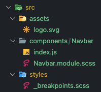

# Redux

```bash
yarn add react-redux @reduxjs/toolkit
```

# Sumário

1. [Gerenciamento de Estados Globais](#gerenciamento)
2. [Tópicos Adicionais](#adicionais)

# Gerenciamento de Estado Globais <a href="gerenciamento" />

* Curso: https://cursos.alura.com.br/course/react-gerenciamento-estados-globais-redux/
* Projeto: https://github.com/alura-cursos/trato-tech/tree/aula1.2


Para começar o projeto:

```bash
npx create-react-app trato-tech
yarn create react-app trato-tec
```


# Tópicos Adicionais <a href="adicionais"/>

## Classnames

```bash
yarn add classnames
```

O classnames nos ajuda a trabalhar com **classes de css  condicionais**, exemplo:

* Sem classname:

  ```react
  let selecionado = true;
  
  return	<div className={selecionado ? 'myCustomClass' : ''} />
  ```

* Com classname:

  ```react
  let selecionado = true;
  
  return <div className={classNames({ 'myCustomClass': selecionado })} />
  ```

Também é possível **adicionar mais de uma class ao elemento**, basta separarmos por vírgula:

* Exemplo, dado que `href` sempre tem que:
  * receber a class `links`
  * receber a class `selected` condicionamente (se estiver no path dado)

```react
import styles from "./Navbar.module.scss";
// com CSS Modules, é necessário por entre [] o estilo

return 
  <a
    href="/inicio"
    className={classNames(styles.link, {
      [styles.selected]: window.location.pathname === "/inicio",
    })}
  >
    Página Inicial
  </a>
```


## CSS Modules

```bash
yarn add sass
```

O Css Modules nos ajuda com:

* Evitar sobreposição de classes;
* Nos retorna um objeto que contém todos os estilos!

Exemplo:

* Sem CSS Module:

  ```react
  import './Navbar.scss';
  
  return <div className='nav' />
  ```

* Com CSS Module:

  ```react
  import styles from './Navbar.module.scss';
  
  // {nomeDaVariavel}.{nomeDaClasse}
  return <div className={styles.nav} />
  ```

  * Na prática, o browser irá criar um id para cada classe: `{nomeDaVariavel}.{nomeDaClasse}.{id}`

    ```html
    <!-- Neste exemplo a class '.nav' recebe id VwSpp-->
    <nav class=”Navbar_nav__VwSpp”> … </nav>
    ```


## JSConfig

```bash
jsconfig.json
```

JSConfig possui diversas propriedades, uma mais comum:

```json
{
  "compilerOptions": {
    "baseUrl": "src"
  },
  "include": ["src"]
}
```

* O **baseURL** nos deixa importar coisas de forma absoluta (**sempre começando de src**).

Exemplo considerando a estrutura abaixo, importe do `Navbar.module.scss` o `_breakpoints.scss`:



* Sem JSConfig:

  ```react
  @import '../../styles/breakpoints';
  ```

* Com JSConfig:

  ```react
  @import 'styles/breakpoints';
  ```


## Routes (relembrando)

```bash
yarn add react-router-dom
```

* Crie um arquivo `/src/routes.js`

  * **`BrowserRouter`** -> Criado para indicar que haverá mudança nas rotas;
  * **`Routes`** -> Indica que haverá várias `Route` dentro;
  * **`Route`** -> É onde informamos ao react qual `element` carregar quando o `path` der match;
  * **`Outlet`** -> É onde fica o conteúdo 'específico', ou seja, teremos um Navbar e um footer, o resto é o conteúdo específico;
  * **`Link`** -> Versão do `a href` para SPA;
  * **`useLocation`** -> hook para pegar informações do `pathname`;
  * **`useParam`** -> hook para pegar os parâmetros da URL - `/categoria/:nomeCategoria`;
  * **`useNavigate`** -> hook para navegar entre as páginas;

  ```react
  import { BrowserRouter, Route, Routes } from "react-router-dom";
  import LandingPage from 'components/LandingPage'
  
  export default function Router() {
    return (
      <BrowserRouter>
        <Routes>
          <Route path="/" element={<LandingPage />}>
            <Route index element={<div>home</div>} />
          </Route>
        </Routes>
      </BrowserRouter>
    );
  }
  ```

* No `index.js` importe este arquivo

  ```react
  import React from "react";
  import ReactDOM from "react-dom/client";
  import Router from "routes";
  import "./index.css";
  
  const root = ReactDOM.createRoot(document.getElementById("root"));
  root.render(
    <React.StrictMode>
      <Router />
    </React.StrictMode>
  );
  
  ```


